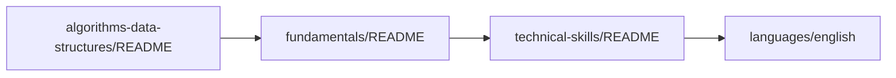
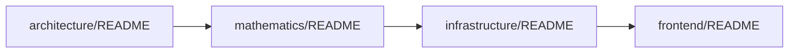
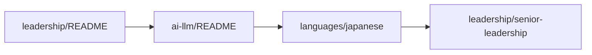

# 📚 Документация проекта обучения

> **Комплексная система знаний для IT-специалистов**
> От основ до экспертного уровня с практическими примерами

## 🗂️ Карта знаний

### 🧮 [[algorithms-data-structures/README|Алгоритмы и структуры данных]]
Фундаментальная основа для любого программиста
- [[algorithms-data-structures/complexity-analysis|Анализ сложности алгоритмов]] - Big O, временная и пространственная сложность
- [[algorithms-data-structures/data-structures|Структуры данных]] и их применение
- [[algorithms-data-structures/interview-patterns|Паттерны решения задач]] для собеседований
- [[algorithms-data-structures/faang-preparation|Подготовка к FAANG]] - топ-150 задач для крупных компаний
- [[algorithms-data-structures/advanced-algorithms|Продвинутые алгоритмы]] - сложные алгоритмы и структуры данных
- [[algorithms-data-structures/systems-programming|Системное программирование]] - низкоуровневые аспекты разработки

**Связанные разделы:** [[mathematics/README|Математика]] • [[technical-skills/README|Технические навыки]]

### 🗣️ [[languages/README|Изучение языков]]
Развитие коммуникационных навыков для международной карьеры
- [[languages/english|Английский язык]] - техническая лексика и деловое общение
- [[languages/japanese|Японский язык]] - основы и культурные особенности
- [[languages/japanese-30-day-intensive/README|30-дневный интенсив японского]] ⭐ Premium курс
- [[languages/native-level-strategy|Стратегия достижения уровня носителя]]

**Связанные разделы:** [[leadership/README|Лидерство]] • [[leadership/senior-communication|Коммуникация]]

### 📊 [[mathematics/README|Математика для программистов]]
Математические основы для понимания алгоритмов и ML
- [[mathematics/programming-math|Основы математики]] - дискретная математика, алгебра, геометрия
- [[mathematics/probability-statistics|Теория вероятностей и статистика]] - применение в Data Science
- [[mathematics/mathematical-analysis|Математический анализ]] - дифференциальное и интегральное исчисление
- [[mathematics/discrete-mathematics|Дискретная математика]] - теория графов, комбинаторика
- [[mathematics/theory-of-computation|Теория вычислений]] - автоматы, формальные языки, вычислимость, сложность
- [[mathematics/numerical-methods|Численные методы]] - вычислительная математика
- [[mathematics/optimization|Оптимизация]] - линейное и нелинейное программирование

**Связанные разделы:** [[algorithms-data-structures/README|Алгоритмы]] • [[ai-llm/README|AI/ML]]

### 🏗️ [[architecture/README|Архитектура]]
Проектирование масштабируемых систем
- [[architecture/microservices-architecture|Микросервисная архитектура]] - проектирование и паттерны
- [[architecture/api-design|Проектирование API]] - REST, GraphQL, gRPC
- [[architecture/senior-architecture|Senior архитектура]] - принятие архитектурных решений

**Связанные разделы:** [[fundamentals/README|Основы]] • [[infrastructure/README|Инфраструктура]]

### 🎯 [[fundamentals/README|Основы разработки]]
Фундаментальные принципы качественного кода
- [[fundamentals/solid-principles|SOLID принципы]] - основы ОО-проектирования
- [[fundamentals/gof-patterns|GoF паттерны]] - классические паттерны проектирования
- [[fundamentals/clean-architecture|Чистая архитектура]] - слоистая архитектура
- [[fundamentals/ddd-patterns|DDD подходы]] - доменно-ориентированное проектирование
- [[fundamentals/cqrs-pattern|CQRS]] - разделение команд и запросов
- [[fundamentals/event-sourcing|Event Sourcing]] - архитектура на основе событий

**Связанные разделы:** [[architecture/README|Архитектура]] • [[technical-skills/README|Технические навыки]]

### 🔧 [[technical-skills/README|Технические навыки]]
Специализированные технические компетенции
- [[technical-skills/databases|Базы данных]] - SQL, NoSQL, проектирование схем
- [[technical-skills/security|Безопасность]] - криптография, аутентификация, авторизация
- [[technical-skills/testing|Тестирование]] - модульное, интеграционное, E2E
- [[technical-skills/concurrency-async|Параллельное программирование]] - многопоточность, асинхронность
- [[technical-skills/senior-technical-mastery|Senior техническое мастерство]]

**Связанные разделы:** [[fundamentals/README|Основы]] • [[infrastructure/README|Инфраструктура]]

### 🚀 [[infrastructure/README|Инфраструктура]]
DevOps и управление инфраструктурой
- [[infrastructure/computer-networks|Компьютерные сети и Интернет]] - сетевые протоколы и технологии
- [[infrastructure/docker-containerization|Docker и контейнеризация]] - основы контейнеров
- [[infrastructure/cicd-devops|CI/CD и DevOps]] - автоматизация процессов
- [[infrastructure/deployment-monitoring|Деплой и мониторинг]] - эксплуатация систем
- [[infrastructure/linux-deployment|Linux для деплоя]] - администрирование серверов

**Связанные разделы:** [[architecture/README|Архитектура]] • [[technical-skills/README|Технические навыки]]

### 👥 [[leadership/README|Лидерство и управление]]
Развитие лидерских качеств и карьерный рост
- [[leadership/team-management|Управление командой]] - менеджмент и мотивация
- [[leadership/senior-communication|Коммуникация]] - техническая и бизнес коммуникация
- [[leadership/senior-career-roadmap|Карьерный рост]] - путь к Senior+ позициям
- [[leadership/senior-business|Бизнес-навыки]] - понимание бизнеса и продукта
- [[leadership/senior-leadership|Senior лидерство]] - принятие решений и влияние

**Связанные разделы:** [[languages/README|Языки]] • [[fundamentals/README|Основы]]

### 🌐 [[frontend/README|Frontend разработка]]
Современная фронтенд разработка
- [[frontend/react-ecosystem|React экосистема]] - современный React стек
- [[frontend/vue-ecosystem|Vue экосистема]] - Vue.js и инструменты
- [[frontend/modern-frontend-architecture|Современная архитектура]] - микрофронтенды, SSR
- [[frontend/frontend-advanced|Продвинутые техники]] - оптимизация и performance

**Связанные разделы:** [[architecture/README|Архитектура]] • [[technical-skills/README|Технические навыки]]

### 🧠 [[ai-llm/README|Искусственный интеллект]]
Машинное обучение и работа с AI
- [[ai-llm/ai-fundamentals|Основы AI]] - введение в машинное обучение
- [[ai-llm/computer-vision|Computer Vision]] - обработка изображений
- [[algorithms-data-structures/machine-learning-ai|ML алгоритмы]] - алгоритмы машинного обучения
- [[algorithms-data-structures/neural-networks-deep-learning|Neural Networks]] - глубокое обучение

**Связанные разделы:** [[mathematics/README|Математика]] • [[algorithms-data-structures/README|Алгоритмы]]

---

## 🗺️ Траектории обучения

### 👶 **Новичок → Junior (6-12 месяцев)**

**Путь:** [[algorithms-data-structures/README|Алгоритмы]] → [[fundamentals/README|Основы]] → [[technical-skills/README|Технические навыки]] → [[languages/english|Английский]]

### 🎯 **Junior → Middle (12-24 месяца)**

**Путь:** [[architecture/README|Архитектура]] → [[mathematics/README|Математика]] → [[infrastructure/README|Инфраструктура]] → специализация

### 🚀 **Middle → Senior (24-36 месяцев)**

**Путь:** [[leadership/README|Лидерство]] → [[ai-llm/README|AI/ML]] → [[languages/japanese|Японский]] → [[leadership/senior-leadership|Senior лидерство]]

### 🏆 **Senior → Lead/Principal (3+ года)**
Специализация и экспертность в выбранной области + менторство

---

## 🎯 Практические проекты

### 🔰 Начальный уровень
- **TODO приложение** - применение [[fundamentals/solid-principles|SOLID]] и [[fundamentals/gof-patterns|паттернов]]
- **Калькулятор** - практика [[algorithms-data-structures/algorithms|алгоритмов]]
- **Простая игра** - изучение [[mathematics/programming-math|математики]]

### ⚡ Средний уровень  
- **Система блога** - [[architecture/api-design|API]] + [[technical-skills/databases|БД]] + [[infrastructure/docker-containerization|Docker]]
- **E-commerce платформа** - [[fundamentals/clean-architecture|Clean Architecture]] + [[fundamentals/ddd-patterns|DDD]]
- **Чат-приложение** - [[technical-skills/concurrency-async|Асинхронность]] + WebSockets

### 🔥 Продвинутый уровень
- **Микросервисная система** - [[architecture/microservices-architecture|Микросервисы]] + [[infrastructure/cicd-devops|CI/CD]]
- **ML платформа** - [[ai-llm/README|AI/ML]] + [[mathematics/optimization|Оптимизация]]
- **Распределенная система** - [[technical-skills/senior-technical-mastery|Senior техники]]

---

## 📊 Система прогресса

### 🎯 **Цели по этапам**

#### Краткосрочные (1-3 месяца)
- [ ] Освоение [[algorithms-data-structures/complexity-analysis|анализа сложности]]
- [ ] Изучение [[languages/english|технической лексики на английском]]
- [ ] Понимание [[mathematics/programming-math|математических основ]]
- [ ] Применение [[fundamentals/solid-principles|SOLID принципов]]

#### Среднесрочные (3-12 месяцев)  
- [ ] Подготовка к [[algorithms-data-structures/faang-preparation|собеседованиям в FAANG]]
- [ ] Изучение [[architecture/microservices-architecture|архитектурных паттернов]]
- [ ] Развитие [[leadership/senior-communication|коммуникационных навыков]]
- [ ] Специализация в выбранной области

#### Долгосрочные (1+ лет)
- [ ] Экспертность в технической области
- [ ] [[leadership/senior-leadership|Лидерские навыки]]
- [ ] [[languages/japanese|Международные возможности]]
- [ ] Менторство и обучение других

### 📈 **Метрики развития**
- **Технические навыки** - решение алгоритмических задач, качество кода
- **Коммуникация** - презентации, техническое письмо, менторство
- **Лидерство** - управление проектами, принятие решений
- **Продукт** - влияние на бизнес-метрики, пользовательский опыт

---

## 🛠️ Инструменты и ресурсы

### 💻 **Платформы для обучения**
- **LeetCode** - практика [[algorithms-data-structures/faang-preparation|алгоритмов]]
- **Coursera/edX** - [[mathematics/README|математические курсы]]
- **YouTube** - [[languages/README|изучение языков]]
- **GitHub** - open source проекты для практики

### 📚 **Рекомендуемые книги**
- **"Clean Code"** - для [[fundamentals/README|основ разработки]]
- **"System Design Interview"** - для [[architecture/README|архитектуры]]
- **"CLRS"** - для [[algorithms-data-structures/README|алгоритмов]]
- **"Mathematics for Computer Science"** - для [[mathematics/README|математики]]

### 🔧 **Технический стек**
- **Языки:** Go, Python, JavaScript, TypeScript
- **Инфраструктура:** Docker, Kubernetes, AWS/GCP
- **Базы данных:** PostgreSQL, MongoDB, Redis
- **Инструменты:** Git, CI/CD, мониторинг

---

## 🌟 Особенности подхода

### 🎯 **Практическая направленность**
- Реальные примеры кода в каждом разделе
- Связь теории с повседневными задачами
- Проекты для закрепления знаний

### 🧠 **Глубина изучения**  
- От основ до экспертного уровня
- Подробные объяснения концепций
- Множественные примеры и практики

### 🌍 **Международная перспектива**
- [[languages/english|Английский для IT]]
- [[languages/japanese|Японский для работы в Японии]]
- Культурные особенности разработки в разных странах

---

## 🔗 Навигация

- [[theory-index|Индекс теоретических материалов]] - сводка всех концепций
- [[swagger/README|API документация]] - примеры реальных API
- Практические проекты в `/services/` - микросервисы для изучения

---

💡 **Совет:** Начните с изучения [[algorithms-data-structures/README|основ алгоритмов]], затем выберите специализацию. Каждый раздел содержит практические примеры - не просто читайте, а программируйте! 