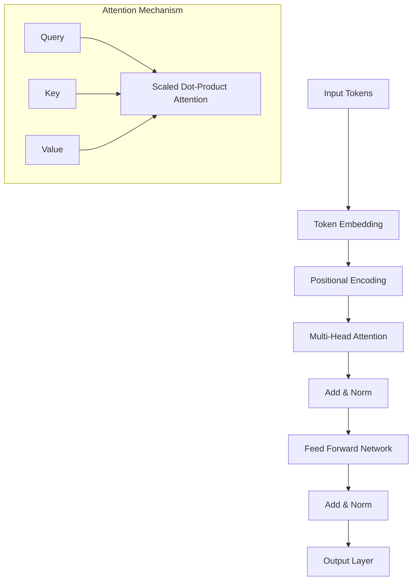

# 🌐 Большие языковые модели (LLM)

## 📝 Введение в LLM

### Что такое большие языковые модели?
- **Определение** - нейронные сети, обученные на огромных текстовых корпусах для понимания и генерации языка
- **Масштаб** - от миллиардов до триллионов параметров
- **Возможности** - текстовая генерация, перевод, суммаризация, программирование, рассуждения
- **Эмерджентные свойства** - способности, которые появляются при достижении определенного масштаба

### Ключевые характеристики
```
Основные свойства LLM:
├── Few-shot learning - обучение на малом количестве примеров
├── In-context learning - обучение в контексте без изменения весов
├── Transfer learning - перенос знаний между задачами
├── Emergent abilities - эмерджентные способности при масштабировании
├── Multimodal capabilities - работа с разными типами данных
└── Chain-of-thought reasoning - пошаговое рассуждение
```

---

## 🏗️ Архитектура трансформеров

### Transformer Architecture


### Self-Attention механизм
```python
import torch
import torch.nn as nn
import math

class MultiHeadAttention(nn.Module):
    def __init__(self, d_model, n_heads):
        super().__init__()
        self.d_model = d_model
        self.n_heads = n_heads
        self.d_k = d_model // n_heads
        
        self.W_q = nn.Linear(d_model, d_model)
        self.W_k = nn.Linear(d_model, d_model)
        self.W_v = nn.Linear(d_model, d_model)
        self.W_o = nn.Linear(d_model, d_model)
        
    def scaled_dot_product_attention(self, Q, K, V, mask=None):
        # Q, K, V: [batch_size, n_heads, seq_len, d_k]
        scores = torch.matmul(Q, K.transpose(-2, -1)) / math.sqrt(self.d_k)
        
        if mask is not None:
            scores = scores.masked_fill(mask == 0, -1e9)
            
        attention_weights = torch.softmax(scores, dim=-1)
        output = torch.matmul(attention_weights, V)
        
        return output, attention_weights
    
    def forward(self, query, key, value, mask=None):
        batch_size = query.size(0)
        
        # Linear transformations and reshape
        Q = self.W_q(query).view(batch_size, -1, self.n_heads, self.d_k).transpose(1, 2)
        K = self.W_k(key).view(batch_size, -1, self.n_heads, self.d_k).transpose(1, 2)
        V = self.W_v(value).view(batch_size, -1, self.n_heads, self.d_k).transpose(1, 2)
        
        # Attention
        attn_output, attn_weights = self.scaled_dot_product_attention(Q, K, V, mask)
        
        # Concatenate heads and put through final linear layer
        attn_output = attn_output.transpose(1, 2).contiguous().view(
            batch_size, -1, self.d_model)
        
        return self.W_o(attn_output)
```

### Позиционное кодирование
```python
import numpy as np

class PositionalEncoding(nn.Module):
    def __init__(self, d_model, max_seq_length=5000):
        super().__init__()
        
        pe = torch.zeros(max_seq_length, d_model)
        position = torch.arange(0, max_seq_length, dtype=torch.float).unsqueeze(1)
        
        div_term = torch.exp(torch.arange(0, d_model, 2).float() * 
                           (-math.log(10000.0) / d_model))
        
        pe[:, 0::2] = torch.sin(position * div_term)
        pe[:, 1::2] = torch.cos(position * div_term)
        
        self.register_buffer('pe', pe.unsqueeze(0))
        
    def forward(self, x):
        return x + self.pe[:, :x.size(1)]
```

---

## 🌟 Эволюция языковых моделей

### Поколения моделей

```
Эволюция LLM:
├── 2017: Transformer (Attention is All You Need)
├── 2018: BERT (Bidirectional Encoder)
├── 2019: GPT-2 (Generative Pre-training)
├── 2020: GPT-3 (175B параметров)
├── 2021: T5, PaLM, Codex
├── 2022: ChatGPT, InstructGPT
├── 2023: GPT-4, Claude, LLaMA, PaLM-2
└── 2024: GPT-4o, Claude-3, Gemini Ultra
```

### Сравнение основных моделей

| Модель | Параметры | Особенности | Применение |
|--------|-----------|-------------|------------|
| **GPT-4** | ~1.7T | Мультимодальность, рассуждения | Универсальный ассистент |
| **Claude-3** | ~200B | Constitutional AI, безопасность | Этичные диалоги |
| **LLaMA-2** | 7B-70B | Open source, эффективность | Исследования, fine-tuning |
| **Gemini** | ~1T | Мультимодальность от Google | Интеграция с продуктами |
| **PaLM-2** | ~340B | Научные рассуждения | Специализированные задачи |

---

## 🎯 Техники обучения

### Предобучение (Pre-training)
```
Этапы предобучения:
├── Токенизация текста
├── Автопредиктивное обучение (next token prediction)
├── Масштабирование на огромных корпусах
├── Самообучение (self-supervised learning)
└── Эмерджентные способности при масштабе
```

### Дообучение (Fine-tuning)
```python
# Пример fine-tuning с Hugging Face
from transformers import (
    AutoTokenizer, 
    AutoModelForCausalLM,
    TrainingArguments,
    Trainer
)
from datasets import Dataset

# Загрузка предобученной модели
model_name = "microsoft/DialoGPT-medium"
tokenizer = AutoTokenizer.from_pretrained(model_name)
model = AutoModelForCausalLM.from_pretrained(model_name)

# Подготовка данных
def tokenize_function(examples):
    return tokenizer(
        examples['text'], 
        truncation=True, 
        padding=True, 
        max_length=512
    )

# Fine-tuning настройки
training_args = TrainingArguments(
    output_dir='./fine-tuned-model',
    num_train_epochs=3,
    per_device_train_batch_size=4,
    per_device_eval_batch_size=4,
    warmup_steps=500,
    weight_decay=0.01,
    logging_dir='./logs',
    save_strategy="epoch",
    evaluation_strategy="epoch",
    learning_rate=5e-5,
)

# Создание тренера
trainer = Trainer(
    model=model,
    args=training_args,
    train_dataset=train_dataset,
    eval_dataset=eval_dataset,
    tokenizer=tokenizer,
)

# Запуск fine-tuning
trainer.train()
```

### RLHF (Reinforcement Learning from Human Feedback)
```
Процесс RLHF:
├── 1. Supervised Fine-tuning (SFT)
├── 2. Reward Model Training
├── 3. PPO (Proximal Policy Optimization)
└── 4. Итеративное улучшение
```

---

## 🛠️ Практические техники

### LoRA (Low-Rank Adaptation)
```python
# Пример использования LoRA
from peft import LoraConfig, get_peft_model, TaskType

# Конфигурация LoRA
lora_config = LoraConfig(
    task_type=TaskType.CAUSAL_LM,
    inference_mode=False,
    r=8,  # rank
    lora_alpha=32,
    lora_dropout=0.1,
    target_modules=["q_proj", "v_proj", "k_proj", "o_proj"]
)

# Применение LoRA к модели
model = get_peft_model(model, lora_config)

# Значительное сокращение обучаемых параметров
model.print_trainable_parameters()
# trainable params: 4,194,304 || all params: 6,742,609,920 || trainable%: 0.062
```

### Квантизация
```python
from transformers import BitsAndBytesConfig
import torch

# 4-bit квантизация
quantization_config = BitsAndBytesConfig(
    load_in_4bit=True,
    bnb_4bit_compute_dtype=torch.float16,
    bnb_4bit_quant_type="nf4",
    bnb_4bit_use_double_quant=True,
)

model = AutoModelForCausalLM.from_pretrained(
    model_name,
    quantization_config=quantization_config,
    device_map="auto"
)
```

---

## 🎨 Генеративные возможности

### Стратегии декодирования
```python
# Различные методы генерации текста
from transformers import pipeline

generator = pipeline("text-generation", model="gpt2")

# Greedy decoding
output_greedy = generator(
    "The future of AI is",
    max_length=50,
    do_sample=False
)

# Sampling with temperature
output_sampling = generator(
    "The future of AI is",
    max_length=50,
    do_sample=True,
    temperature=0.7,
    top_p=0.9,
    top_k=50
)

# Beam search
output_beam = generator(
    "The future of AI is",
    max_length=50,
    num_beams=5,
    early_stopping=True
)
```

### Контроль генерации
```python
# Управление стилем и содержанием
def controlled_generation(prompt, style="formal", topic="technology"):
    # Добавление системного промпта
    system_prompt = f"Write in {style} style about {topic}: "
    full_prompt = system_prompt + prompt
    
    # Генерация с контролем
    output = generator(
        full_prompt,
        max_length=200,
        temperature=0.7,
        repetition_penalty=1.1,
        pad_token_id=tokenizer.eos_token_id
    )
    
    return output[0]['generated_text']
```

---

## 📊 Оценка и метрики

### Автоматические метрики
```
Метрики для языковых моделей:
├── Perplexity - недоумение модели
├── BLEU - сравнение с референсами
├── ROUGE - для суммаризации
├── BERTScore - семантическое сходство
├── Human Eval - для кода
└── HellaSwag - здравый смысл
```

### Человеческая оценка
```
Критерии оценки:
├── Релевантность ответов
├── Фактическая точность
├── Связность и логичность
├── Безопасность и этичность
├── Полезность для пользователя
└── Стиль и тон общения
```

---

## 🚀 Современные применения

### Мультимодальные модели
```
Возможности:
├── Текст + Изображения (GPT-4V, CLIP)
├── Текст + Аудио (Whisper, MusicLM)
├── Текст + Видео (Flamingo, VideoBERT)
├── Текст + Код (Codex, CodeT5)
└── Универсальные ассистенты
```

### Агентные системы
```python
# Пример AI агента с использованием LangChain
from langchain.agents import initialize_agent, Tool
from langchain.llms import OpenAI
from langchain.tools import DuckDuckGoSearchRun

# Инициализация инструментов
search = DuckDuckGoSearchRun()
tools = [
    Tool(
        name="Search",
        func=search.run,
        description="useful for searching current information"
    )
]

# Создание агента
agent = initialize_agent(
    tools=tools,
    llm=OpenAI(temperature=0),
    agent="zero-shot-react-description",
    verbose=True
)

# Использование агента
response = agent.run(
    "What are the latest developments in large language models?"
)
```

---

## 🔮 Будущие направления

### Архитектурные инновации
```
Перспективные направления:
├── Mixture of Experts (MoE)
├── Retrieval-Augmented Generation (RAG)
├── Memory-augmented networks
├── Sparse attention mechanisms
├── Constitutional AI approaches
└── Quantum-enhanced language models
```

### Вызовы и решения
```
Текущие проблемы:
├── Галлюцинации - выдумывание фактов
├── Bias - предвзятость в данных
├── Alignment - соответствие человеческим ценностям
├── Interpretability - объяснимость решений
├── Efficiency - энергопотребление
└── Safety - безопасность использования
```

---

## 📚 Дополнительные ресурсы

### Практические инструменты
- **Hugging Face Transformers** - библиотека для работы с LLM
- **LangChain** - фреймворк для LLM приложений
- **OpenAI API** - доступ к GPT моделям
- **Anthropic Claude** - безопасные языковые модели
- **Google PaLM API** - модели от Google

### Обучающие материалы
- [[prompt-engineering|Prompt Engineering]] - искусство составления запросов
- [[fine-tuning-rag|Fine-tuning и RAG]] - адаптация моделей
- [[ai-in-production|AI в продакшене]] - развертывание моделей
- [[ai-ethics-safety|Этика и безопасность]] - ответственное использование

---

💡 **Совет:** Начните с изучения базовой архитектуры трансформеров, затем экспериментируйте с готовыми моделями через Hugging Face, и постепенно переходите к fine-tuning под ваши задачи. 