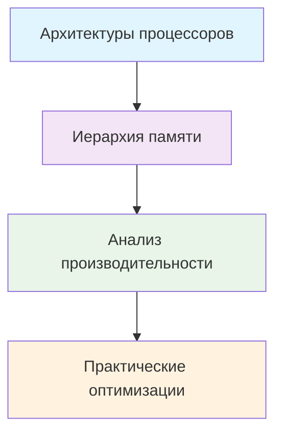
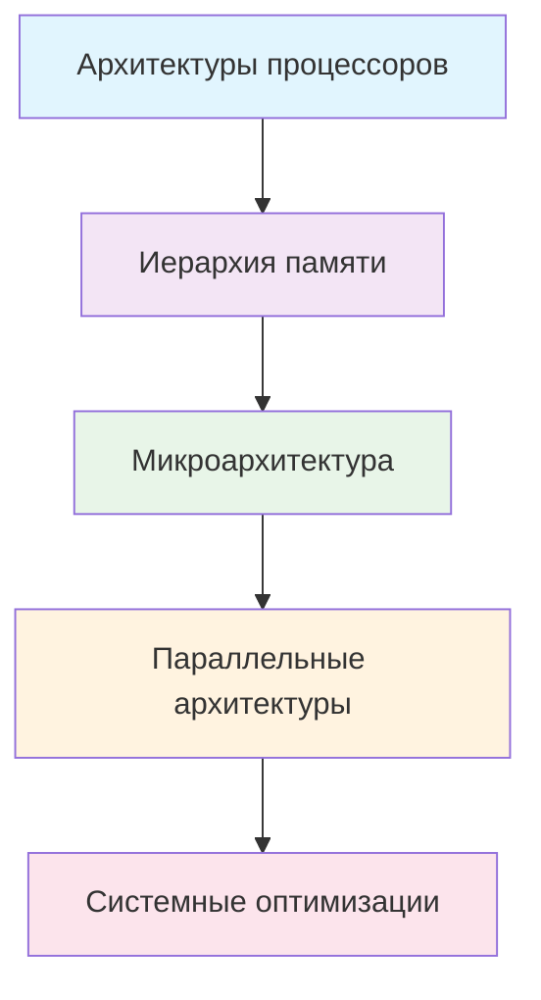
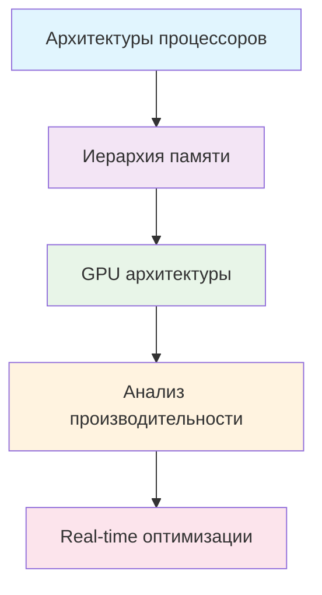
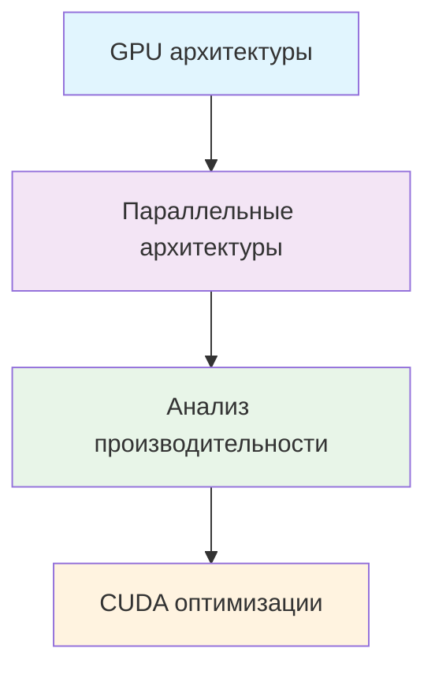

# Архитектура компьютеров 🏗️

> **Навигация**: [[README|← Главная]] | [[algorithms-data-structures/README|Алгоритмы и структуры данных]]

## 🎯 Цель раздела

Глубокое изучение архитектуры компьютерных систем, принципов работы процессоров, памяти и параллельных вычислений. Понимание того, как работает "железо" - основа для написания эффективного кода.

## 📚 Содержание раздела

### 🔧 Основы архитектуры
1. **[[processor-architectures|Архитектуры процессоров]]** `⏱️ 3-4 недели`
   - CISC vs RISC архитектуры
   - ISA (Instruction Set Architecture)
   - x86-64, ARM, RISC-V

2. **[[memory-hierarchy|Иерархия памяти]]** `⏱️ 2-3 недели`
   - Кэш-память и локальность данных
   - Виртуальная память и MMU
   - TLB и оптимизации доступа

3. **[[microarchitecture|Микроархитектура]]** `⏱️ 3-4 недели`
   - Конвейер выполнения команд
   - Предсказание ветвлений
   - Суперскалярные процессоры

### ⚡ Продвинутые темы
4. **[[parallel-architectures|Параллельные архитектуры]]** `⏱️ 4-5 недель`
   - Многоядерные процессоры
   - Когерентность кэша
   - NUMA архитектуры

5. **[[gpu-architectures|GPU архитектуры]]** `⏱️ 3-4 недели`
   - CUDA и параллельные вычисления
   - Архитектуры NVIDIA и AMD
   - Compute Shaders

6. **[[performance-analysis|Анализ производительности]]** `⏱️ 2-3 недели`
   - Профилирование и оптимизация
   - Bottleneck анализ
   - Performance counters

## 🎯 Траектории изучения

### 🔰 Backend разработчик (8-10 недель)

**Фокус**: Понимание кэша, оптимизация алгоритмов, профилирование кода

### 🔧 Systems программист (12-16 недель)

**Фокус**: Глубокое понимание всех уровней, оптимизация системного ПО

### 🎮 Game/Engine разработчик (10-12 недель)

**Фокус**: CPU и GPU оптимизации, real-time производительность

### 🧠 ML/AI инженер (8-10 недель)

**Фокус**: GPU computing, параллельные алгоритмы, CUDA/OpenCL

## 🚀 Практические проекты

### 🔰 Начальный уровень (2-4 недели каждый)
1. **CPU Cache Simulator**
   - Реализация простого кэша с LRU
   - Анализ hit/miss ratio
   - Визуализация работы кэша

2. **Assembly Performance Profiler**
   - Анализ ассемблерного кода
   - Подсчет инструкций
   - Сравнение компиляторов

3. **Memory Access Patterns**
   - Benchmark различных паттернов доступа
   - Измерение влияния на производительность
   - Оптимизация алгоритмов

### 🚀 Средний уровень (4-6 недель каждый)
1. **Multi-core Task Scheduler**
   - Планировщик задач для многоядерных систем
   - Балансировка нагрузки
   - NUMA-aware размещение

2. **Branch Predictor Simulator**
   - Различные алгоритмы предсказания
   - Статистика точности
   - Влияние на производительность

3. **GPU Memory Manager**
   - Управление памятью GPU
   - Оптимизация трансферов
   - Memory coalescing

### 🎯 Продвинутый уровень (6-8 недель каждый)
1. **Custom SIMD Library**
   - Векторизация алгоритмов
   - AVX/SSE оптимизации
   - Cross-platform решения

2. **Performance Analysis Framework**
   - Автоматическое профилирование
   - Bottleneck detection
   - Рекомендации по оптимизации

3. **Heterogeneous Computing Platform**
   - CPU + GPU вычисления
   - Динамическое распределение задач
   - Оптимизация энергопотребления

## 📊 Система прогресса

### 📋 Чеклист знаний
- [ ] **Основы архитектуры**
  - [ ] Понимаю разницу CISC vs RISC
  - [ ] Знаю основные ISA (x86-64, ARM, RISC-V)
  - [ ] Понимаю режимы адресации
  
- [ ] **Иерархия памяти**
  - [ ] Понимаю принципы работы кэша
  - [ ] Знаю виды локальности данных
  - [ ] Умею оптимизировать доступ к памяти
  
- [ ] **Микроархитектура**
  - [ ] Понимаю работу конвейера
  - [ ] Знаю виды hazard'ов и их решения
  - [ ] Понимаю предсказание ветвлений
  
- [ ] **Параллелизм**
  - [ ] Знаю архитектуры многоядерных процессоров
  - [ ] Понимаю когерентность кэша
  - [ ] Умею писать NUMA-aware код
  
- [ ] **GPU архитектуры**
  - [ ] Понимаю SIMT модель
  - [ ] Знаю архитектуру CUDA
  - [ ] Умею оптимизировать GPU код
  
- [ ] **Производительность**
  - [ ] Умею профилировать код
  - [ ] Знаю инструменты анализа
  - [ ] Умею находить bottleneck'и

### 🎯 Практические навыки
- [ ] Написал кэш-симулятор
- [ ] Оптимизировал алгоритмы под архитектуру
- [ ] Профилировал реальное приложение
- [ ] Написал CUDA kernel
- [ ] Использовал SIMD инструкции
- [ ] Анализировал ассемблерный код

## 🛠️ Инструменты и технологии

### 📊 Профилирование
- **Intel VTune** - детальный анализ производительности
- **perf** - Linux performance profiling
- **Valgrind** - анализ памяти и производительности
- **Google Benchmark** - микробенчмарки

### 🔧 Разработка
- **Intel Intrinsics Guide** - SIMD инструкции
- **NVIDIA Nsight** - CUDA профилирование
- **Compiler Explorer** - анализ ассемблерного кода
- **likwid** - hardware performance monitoring

### 📚 Симуляция
- **gem5** - детальный симулятор архитектуры
- **SimpleScalar** - академический симулятор
- **Sniper** - многоядерный симулятор
- **GPGPU-Sim** - GPU симулятор

## 🌟 Современные тренды 2024

### 🔥 Горячие направления
- **RISC-V** - открытая архитектура набирает популярность
- **ARM in Data Centers** - Graviton, M-series chips
- **Chiplet Design** - модульная архитектура процессоров
- **In-Memory Computing** - вычисления в памяти
- **Neuromorphic Computing** - архитектуры для ИИ

### 📈 Растущий спрос
- **Performance Engineering** - оптимизация под конкретное железо
- **Energy-Efficient Computing** - Green IT
- **Edge Computing Architecture** - архитектуры для IoT
- **Quantum-Classical Hybrid** - интеграция с квантовыми системами

## 🔗 Связанные разделы

- [[systems-programming|Системное программирование]] - применение знаний архитектуры
- [[algorithms-optimization|Оптимизация алгоритмов]] - architecture-aware оптимизации
- [[parallel-computing|Параллельные вычисления]] - использование многоядерности
- [[performance-tuning|Настройка производительности]] - практическое применение

## 📚 Дополнительные ресурсы

### 📖 Книги
- "Computer Architecture: A Quantitative Approach" - Hennessy & Patterson
- "Modern Processor Design" - Shen & Lipasti
- "Parallel Computer Architecture" - Culler, Singh & Gupta
- "GPU Gems" series - NVIDIA

### 🎓 Курсы
- CS252 (Berkeley) - Graduate Computer Architecture
- CS316 (Stanford) - Advanced Computer Architecture
- MIT 6.004 - Computation Structures

### 🌐 Ресурсы
- Intel Architecture Manuals
- ARM Architecture Reference Manual
- NVIDIA CUDA Programming Guide
- AMD GPU Architecture Documentation

---

> **Следующий шаг**: Начните с [[processor-architectures|архитектур процессоров]] для понимания основ, затем переходите к [[memory-hierarchy|иерархии памяти]] для изучения оптимизаций производительности. 