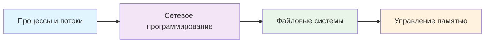
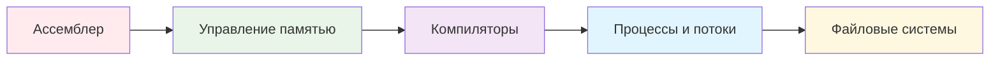
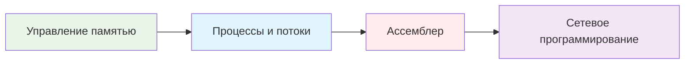
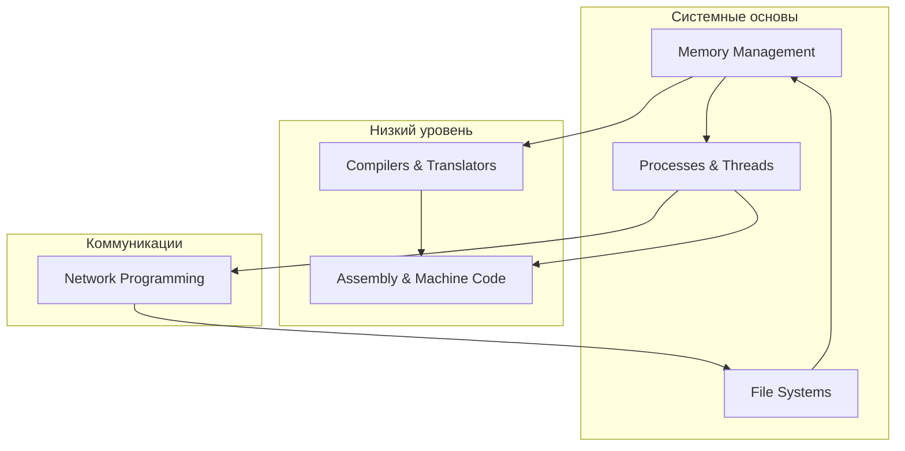

# Системное программирование 🔧

> **Навигация**: [[README|← Главная]] | [[computer-science/README|Компьютерные науки]]

## 🎯 Цель раздела

Углубленное изучение системного программирования, работы с операционными системами и низкоуровневыми аспектами разработки. Понимание того, как работают системы изнутри.

## 📚 Содержание раздела

### 🧠 Управление ресурсами
1. **[[memory-management|Управление памятью]]** `⏱️ 2-3 недели`
   - Менеджеры памяти и аллокаторы
   - Пулы памяти и garbage collection
   - Виртуальная память и MMU

2. **[[processes-threads|Процессы и потоки]]** `⏱️ 3-4 недели`
   - Process API и lifecycle
   - Threading и синхронизация  
   - IPC и shared memory

### 🌐 Системная коммуникация
3. **[[network-programming|Сетевое программирование]]** `⏱️ 3-4 недели`
   - Socket programming (TCP/UDP)
   - Асинхронный I/O (epoll, select)
   - HTTP сервера и протоколы

4. **[[file-systems|Файловые системы]]** `⏱️ 2-3 недели`
   - Файловый I/O и буферизация
   - Файловые системы (ext4, NTFS, ZFS)
   - Мониторинг файлов (inotify)

### 🔬 Низкоуровневое программирование
5. **[[compilers-translators|Компиляторы и трансляторы]]** `⏱️ 4-5 недель`
   - Лексический и синтаксический анализ
   - Оптимизация кода
   - LLVM и промежуточное представление

6. **[[assembly-machine-code|Ассемблер и машинный код]]** `⏱️ 3-4 недели`
   - x86-64 ассемблер
   - Системные вызовы
   - Отладка и дизассемблирование

## 🎯 Траектории обучения

### 🔧 Backend Engineer (10-12 недель)


**Фокус**: Производительность серверных приложений
- Многопоточность и async I/O
- Memory pools для высокой нагрузки
- Network programming patterns

### 🔬 Systems Programmer (14-16 недель)


**Фокус**: Глубокое понимание систем
- Assembly и машинный код
- Custom allocators
- Compiler internals

### 🚀 Performance Engineer (12-14 недель)


**Фокус**: Максимальная производительность
- Zero-copy patterns
- Lock-free structures
- SIMD и векторизация

## 🛠️ Практические проекты

### 🥉 Базовый уровень (2-4 недели каждый)

#### Проект 1: Простой веб-сервер
```c
// Основные возможности:
// - HTTP/1.1 поддержка
// - Static file serving  
// - Basic routing
// - Connection pooling
```

#### Проект 2: Memory allocator
```c
// Функциональность:
// - malloc/free replacement
// - Pool allocators
// - Memory debugging
// - Fragmentation analysis
```

#### Проект 3: Process monitor
```c
// Возможности:
// - Process tree visualization
// - Resource monitoring
// - Signal handling
// - Log aggregation
```

### 🥈 Средний уровень (4-6 недель каждый)

#### Проект 4: Concurrent database
```c
// Архитектура:
// - WAL (Write-Ahead Logging)
// - B-tree indexes
// - Transaction isolation
// - Query optimization
```

#### Проект 5: Network proxy
```c
// Функции:
// - Load balancing
// - Health checks
// - SSL termination
// - Request routing
```

### 🥇 Продвинутый уровень (6-8 недель каждый)

#### Проект 6: JIT компилятор
```c
// Компоненты:
// - Bytecode interpreter
// - Hot spot detection
// - Code generation
// - Runtime optimization
```

#### Проект 7: Operating system kernel
```c
// Модули:
// - Boot loader
// - Memory management
// - Process scheduler
// - Device drivers
```

## 📊 Чеклист навыков

### ✅ Memory Management Expert
- [ ] Понимание virtual memory
- [ ] Custom allocators (pool, slab, buddy)
- [ ] Memory debugging (valgrind, AddressSanitizer)
- [ ] NUMA-aware programming
- [ ] Garbage collection algorithms

### ✅ Concurrency Specialist  
- [ ] Threading models (1:1, N:1, M:N)
- [ ] Synchronization primitives
- [ ] Lock-free programming
- [ ] Actor model implementation
- [ ] Async I/O patterns

### ✅ Network Programming Pro
- [ ] Socket programming (TCP/UDP)
- [ ] High-performance networking (epoll, io_uring)
- [ ] Protocol implementation
- [ ] Load balancing strategies
- [ ] Network debugging

### ✅ Compiler Technology
- [ ] Lexical/syntactic analysis
- [ ] IR (Intermediate Representation)
- [ ] Code optimization passes
- [ ] Target code generation
- [ ] Runtime systems

### ✅ Systems Architecture
- [ ] OS kernel internals
- [ ] Hardware abstraction
- [ ] Performance profiling
- [ ] System call optimization
- [ ] Driver development

## 🏆 Горячие направления 2024

### 🔥 Trending Technologies
1. **Rust Systems Programming**
   - Memory safety без GC
   - Zero-cost abstractions
   - WebAssembly target

2. **eBPF Programming**
   - Kernel programming
   - Observability tools
   - Network functions

3. **WASM Runtime Development**
   - Sandboxed execution
   - Near-native performance
   - Cross-platform deployment

4. **GPU Compute Programming**
   - CUDA/OpenCL alternatives
   - GPGPU for systems tasks
   - Heterogeneous computing

5. **Edge Computing Systems**
   - Low-latency processing
   - Resource-constrained environments
   - Real-time guarantees

### 📈 Растущий спрос
- **Cloud Infrastructure** (Kubernetes, containers)
- **Observability Tools** (tracing, metrics, logs)  
- **Security Systems** (sandboxing, isolation)
- **Real-time Systems** (audio/video processing)
- **High-frequency Trading** (ultra-low latency)

## 🎓 Карьерные треки

### 💼 Роли в индустрии

**Systems Engineer** (Middle: 200-350k₽, Senior: 350-600k₽)
- OS и kernel development
- Device drivers
- Embedded systems

**Performance Engineer** (Middle: 250-400k₽, Senior: 400-700k₽)  
- Application optimization
- Profiling и tuning
- Hardware-software co-design

**Infrastructure Engineer** (Middle: 300-450k₽, Senior: 450-800k₽)
- Cloud platforms
- Container orchestration
- Service mesh

**Compiler Engineer** (Middle: 300-500k₽, Senior: 500-900k₽)
- Language implementation
- Code optimization
- Static analysis

## 🔗 Связи между темами



---

## 🎯 План изучения по времени

### Быстрый трек (6-8 недель)
**Цель**: Базовое понимание системного программирования
1. Процессы и потоки (1.5 недели)
2. Сетевое программирование (2 недели) 
3. Управление памятью (1.5 недели)
4. Файловые системы (1 неделя)

### Стандартный трек (10-14 недель)
**Цель**: Уверенное владение системным программированием
1. Управление памятью (2-3 недели)
2. Процессы и потоки (3 недели)
3. Сетевое программирование (3 недели)
4. Файловые системы (2 недели)
5. Один из: Компиляторы ИЛИ Ассемблер (3-4 недели)

### Экспертный трек (16-20 недель)
**Цель**: Глубокая экспертиза в системном программировании
1. Все базовые темы (10 недель)
2. Компиляторы и трансляторы (4-5 недель)
3. Ассемблер и машинный код (3-4 недели)
4. Практический проект (3-5 недель)

---

> **Следующий шаг**: Начните с [[memory-management|управления памятью]] для понимания основ работы с ресурсами системы. 