# 🛠️ Modern Frontend Tooling

> **Современные инструменты Frontend разработки** - полное руководство по настройке, конфигурации и использованию современного инструментария для эффективной разработки веб-приложений.

## 📋 Обзор раздела

Данный раздел охватывает весь спектр современных инструментов для Frontend разработки - от сборщиков и пакетных менеджеров до CI/CD и автоматизации. Материалы структурированы по принципу прогрессивного изучения с практическими примерами конфигураций.

## 🗂️ Структура материалов

### 📦 Основные разделы
- **[[bundlers|🎯 Bundlers]]** - Webpack, Vite, Rollup конфигурации
- **[[package-managers|📦 Package Managers]]** - npm, yarn, pnpm управление
- **[[linting-formatting|🔍 Linting & Formatting]]** - ESLint, Prettier, автоматизация качества
- **[[build-tools|🏗️ Build Tools]]** - PostCSS, компиляция и оптимизация
- **[[development-environment|🖥️ Development Environment]]** - Настройка среды разработки
- **[[frontend-cicd|🚀 Frontend CI/CD]]** - Автоматизация деплоя и тестирования

## 🎯 Траектории обучения

### 👨‍💻 Junior Frontend Developer (4-6 недель)

```mermaid
gantt
    title Траектория Junior Frontend Developer
    dateFormat  X
    axisFormat %s
    
    section Основы
    Package Managers     :a1, 0, 3
    Basic Bundlers       :a2, 2, 5
    Linting Setup        :a3, 4, 7
    
    section Среда
    Dev Environment      :b1, 6, 9
    Basic Build Tools    :b2, 8, 11
    
    section Практика
    Simple CI/CD         :c1, 10, 13
    Проект               :c2, 12, 15
```

### 👨‍💼 Middle Frontend Developer (6-8 недель)  

```mermaid
gantt
    title Траектория Middle Frontend Developer
    dateFormat  X
    axisFormat %s
    
    section Углубление
    Advanced Bundlers    :a1, 0, 4
    Complex Package Mgmt :a2, 3, 6
    Advanced Linting     :a3, 5, 8
    
    section Оптимизация
    Build Optimization   :b1, 7, 10
    Env Configuration    :b2, 9, 12
    
    section Автоматизация
    Advanced CI/CD       :c1, 11, 15
    Deployment Pipeline  :c2, 14, 18
```

### 🚀 Senior Frontend Developer (8-10 недель)

```mermaid
gantt
    title Траектория Senior Frontend Developer
    dateFormat  X
    axisFormat %s
    
    section Архитектура
    Tooling Architecture :a1, 0, 5
    Monorepo Setup       :a2, 4, 8
    Custom Tools         :a3, 7, 11
    
    section Производительность
    Performance Opt      :b1, 10, 14
    Bundle Analysis      :b2, 13, 17
    
    section Лидерство
    Team Standards       :c1, 16, 20
    Tool Selection       :c2, 19, 23
```

## 📊 Метрики освоения

### 🎯 Ключевые компетенции
- **Bundling** - Настройка Webpack/Vite/Rollup (⏱️ 15-20 часов)
- **Package Management** - Работа с npm/yarn/pnpm (⏱️ 8-12 часов)  
- **Code Quality** - ESLint/Prettier автоматизация (⏱️ 10-15 часов)
- **Build Pipeline** - Настройка сборочных процессов (⏱️ 12-18 часов)
- **Dev Environment** - Оптимизация рабочего окружения (⏱️ 8-12 часов)
- **CI/CD Frontend** - Автоматизация деплоя (⏱️ 15-25 часов)

### 📈 Уровни сложности
- 🟢 **Базовый** - Основные концепции и простые конфигурации
- 🟡 **Средний** - Продвинутые настройки и оптимизации  
- 🔴 **Продвинутый** - Архитектурные решения и кастомизация
- ⚫ **Экспертный** - Собственные инструменты и фреймворки

## 🛣️ Рекомендуемый порядок изучения

### Этап 1: Основы (1-2 недели)
1. **Package Managers** - Понимание npm, yarn, pnpm
2. **Базовые Bundlers** - Простая настройка Webpack/Vite
3. **Linting Setup** - Базовый ESLint и Prettier

### Этап 2: Конфигурация (2-3 недели)  
4. **Development Environment** - Настройка VS Code и окружения
5. **Build Tools** - PostCSS и препроцессоры
6. **Продвинутые Bundlers** - Оптимизация и code splitting

### Этап 3: Автоматизация (2-3 недели)
7. **Advanced Linting** - Husky, lint-staged, автоматизация
8. **Frontend CI/CD** - GitHub Actions, Docker, деплой
9. **Production Optimization** - Производительность и мониторинг

## 💼 Карьерные треки

### 🎯 Frontend Architect (12+ недель)
- Дизайн tooling стратегии для команд
- Выбор и интеграция инструментов
- Создание корпоративных стандартов
- Менторинг и обучение команды

### 🔧 Build Engineer (10+ недель)  
- Специализация на сборочных процессах
- Оптимизация производительности сборки
- Кастомные плагины и расширения
- DevOps интеграция

### 🚀 DevOps/Platform Engineer (14+ недель)
- CI/CD платформы для Frontend
- Инфраструктура разработки
- Мониторинг и аналитика
- Автоматизация процессов

## 🔗 Связанные разделы

### Frontend Экосистема
- **[[../react-ecosystem|React Ecosystem]]** - React-специфичные инструменты
- **[[../testing-frontend|Frontend Testing]]** - Тестирование с современными инструментами  
- **[[../modern-frontend-architecture|Frontend Architecture]]** - Архитектурные паттерны

### Технические навыки
- **[[../../technical-skills/ci-cd|CI/CD]]** - Общие принципы автоматизации
- **[[../../infrastructure/docker|Docker]]** - Контейнеризация приложений
- **[[../../technical-skills/security|Security]]** - Безопасность в build процессах

### Инфраструктура  
- **[[../../infrastructure/monitoring|Monitoring]]** - Мониторинг производительности
- **[[../../infrastructure/deployment|Deployment]]** - Стратегии деплоя
- **[[../../technical-skills/performance|Performance]]** - Оптимизация производительности

## 📚 Дополнительные ресурсы

### 📖 Рекомендуемая литература
- "Webpack: From Beginner to Advanced" - Глубокое изучение Webpack
- "Modern Frontend Tooling" - Обзор современных инструментов
- "JavaScript Build Tools" - Сравнение различных решений

### 🎓 Практические проекты
- **Настройка Monorepo** - Yarn workspaces с множественными приложениями
- **Custom Webpack Plugin** - Разработка собственного плагина
- **CI/CD Pipeline** - Полная автоматизация от разработки до продакшена

### 🔗 Полезные ссылки
- [Webpack Documentation](https://webpack.js.org/) - Официальная документация
- [Vite Guide](https://vitejs.dev/) - Современный build tool
- [ESLint Rules](https://eslint.org/docs/rules/) - Правила линтинга

---

*Последнее обновление: 2024 год. Материалы актуализированы под современные стандарты и best practices индустрии.* 