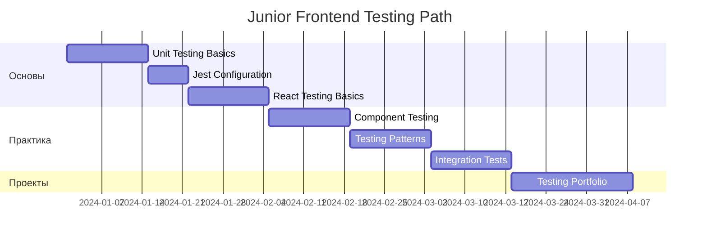
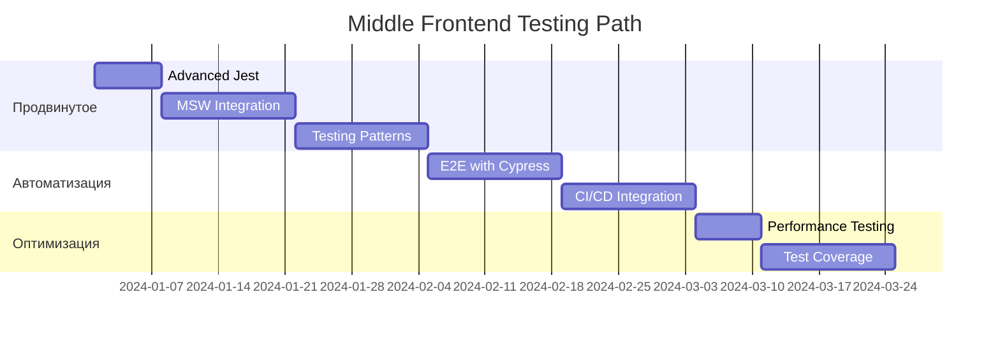
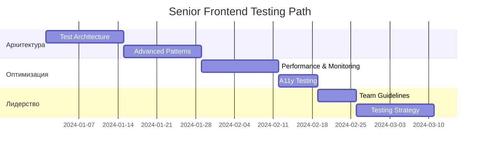
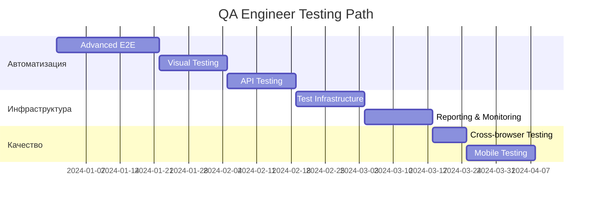

# 🧪 Frontend Testing - Тестирование фронтенд приложений

> **Frontend Testing** - комплексный подход к обеспечению качества фронтенд приложений через юнит-тесты, интеграционные тесты и E2E тестирование.

## 📋 Структура раздела

### 🎯 Основные компоненты

| Файл | Описание | Сложность | Время изучения |
|------|----------|-----------|----------------|
| **[[unit-testing\|🔬 Unit Testing]]** | Jest, мокирование, TDD | 🟢 Базовый | 6-8 часов |
| **[[integration-testing\|🔗 Integration Testing]]** | MSW, API тестирование | 🟡 Средний | 4-6 часов |
| **[[react-testing\|⚛️ React Testing]]** | Testing Library, компоненты | 🟡 Средний | 5-7 часов |
| **[[testing-patterns\|🎯 Testing Patterns]]** | Организация, утилиты, паттерны | 🟡 Средний | 3-5 часов |
| **[[e2e-testing\|🎭 E2E Testing]]** | Cypress, автоматизация | 🔴 Продвинутый | 6-8 часов |

---

## 🛤️ Пути обучения по ролям

### 👨‍💻 Junior Frontend Developer
**Цель**: Освоить основы тестирования фронтенд кода  
**Время**: 12-16 недель  



**Практические задания:**
- ✅ Написать тесты для простых функций
- ✅ Протестировать React компоненты  
- ✅ Настроить Jest в проекте
- ✅ Использовать Testing Library
- ✅ Создать mock-объекты

---

### 👨‍💼 Middle Frontend Developer
**Цель**: Продвинутые техники тестирования и автоматизация  
**Время**: 8-12 недель  



**Ключевые навыки:**
- 🎯 Сложное мокирование API
- 🎯 Custom hooks тестирование
- 🎯 Context providers тестирование
- 🎯 E2E автоматизация
- 🎯 Настройка CI/CD для тестов

---

### 👨‍🔬 Senior Frontend Developer
**Цель**: Экспертиза в тестировании и архитектуре тестов  
**Время**: 6-10 недель  



**Экспертные компетенции:**
- 🚀 Архитектура тестовых сред
- 🚀 Стратегии тестирования
- 🚀 Оптимизация производительности тестов
- 🚀 Accessibility testing
- 🚀 Mentoring команды по тестированию

---

### 🔧 QA Engineer
**Цель**: Глубокая автоматизация и качество  
**Время**: 10-14 недель  



**Специализированные навыки:**
- 🎯 Комплексная автоматизация
- 🎯 Visual regression testing
- 🎯 Cross-browser testing
- 🎯 Mobile testing automation
- 🎯 Test reporting и analytics

---

## 📊 Метрики качества тестирования

### 🎯 Ключевые показатели

```javascript
// Пример конфигурации coverage
// jest.config.js
module.exports = {
  collectCoverageFrom: [
    'src/**/*.{js,jsx,ts,tsx}',
    '!src/index.js',
    '!src/serviceWorker.js'
  ],
  coverageThreshold: {
    global: {
      branches: 80,
      functions: 80,
      lines: 80,
      statements: 80
    }
  },
  coverageReporters: ['html', 'text', 'lcov'],
  testMatch: [
    '<rootDir>/src/**/__tests__/**/*.{js,jsx,ts,tsx}',
    '<rootDir>/src/**/?(*.)(spec|test).{js,jsx,ts,tsx}'
  ]
};
```

### 📈 Уровни покрытия тестами

| Компонент | Юнит-тесты | Интеграционные | E2E |
|-----------|------------|---------------|-----|
| **Utilities** | 90%+ | 70%+ | - |
| **Components** | 80%+ | 60%+ | 40%+ |
| **Pages** | 60%+ | 80%+ | 70%+ |
| **API Integration** | 70%+ | 90%+ | 50%+ |

---

## 🎯 Практические проекты

### 🟢 Базовый уровень
1. **Todo App Testing** - Полное покрытие простого приложения
2. **Calculator Tests** - Юнит-тесты математических функций
3. **Form Validation** - Тестирование валидации форм

### 🟡 Средний уровень
4. **E-commerce Testing** - Интеграционные тесты корзины
5. **User Dashboard** - Тестирование авторизации и состояния
6. **API Integration** - Мокирование внешних сервисов

### 🔴 Продвинутый уровень
7. **Multi-Step Forms** - Сложные пользовательские сценарии
8. **Real-time Features** - WebSocket и live updates
9. **Performance Testing** - Нагрузочные тесты фронтенда

---

## 🛠️ Рекомендуемый стек

### 🧪 Инструменты тестирования

| Категория | Инструмент | Назначение |
|-----------|------------|-----------|
| **Unit Testing** | Jest | Основной фреймворк |
| **React Testing** | Testing Library | Тестирование компонентов |
| **Mocking** | MSW | Mock Service Worker |
| **E2E** | Cypress | End-to-End тестирование |
| **Visual** | Storybook | Визуальное тестирование |

### ⚙️ Конфигурация проекта

```json
{
  "scripts": {
    "test": "jest",
    "test:watch": "jest --watch",
    "test:coverage": "jest --coverage",
    "test:e2e": "cypress run",
    "test:e2e:open": "cypress open"
  },
  "devDependencies": {
    "@testing-library/react": "^13.4.0",
    "@testing-library/jest-dom": "^5.16.5",
    "@testing-library/user-event": "^14.4.3",
    "cypress": "^12.0.0",
    "msw": "^0.49.0",
    "jest": "^29.0.0"
  }
}
```

---

## 🔗 Связанные разделы

- **[[../fundamentals/javascript-fundamentals|📚 JavaScript]]** - Основы для тестирования
- **[[../frontend/react-patterns|⚛️ React Patterns]]** - Паттерны компонентов
- **[[../fundamentals/design-patterns|🎯 Design Patterns]]** - Архитектурные паттерны
- **[[../technical-skills/security|🔒 Security]]** - Безопасность в тестах
- **[[../infrastructure/cicd-advanced|🚀 CI/CD]]** - Автоматизация тестирования

---

⏱️ **Общее время изучения**: 24-30 часов  
🎯 **Уровень**: Базовый - Продвинутый  
📋 **Предварительные требования**: JavaScript ES6+, React, основы веб-разработки 