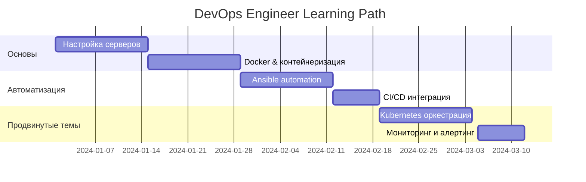
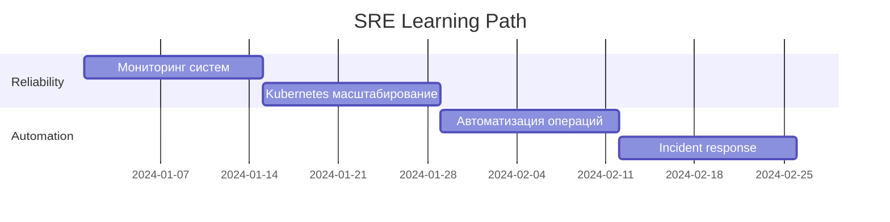
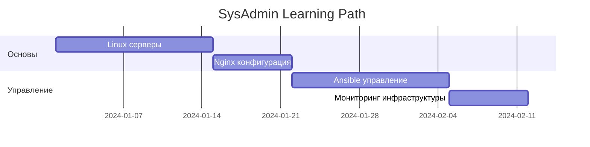

# Linux Deployment 🐧

> **Навигация**: [[../README|← Инфраструктура]] | [[../../README|Главная]]

## 🎯 Цель изучения

Комплексное освоение развертывания приложений на Linux серверах с использованием современных технологий оркестрации, мониторинга и автоматизации.

## 📋 Содержание раздела

### 🛠️ Основные компоненты
1. **[[server-setup|🔧 Настройка серверов]]** - Подготовка Linux серверов, Docker, базовая безопасность
2. **[[ansible-automation|⚙️ Ansible автоматизация]]** - Управление конфигурацией и автоматизация развертывания
3. **[[nginx-load-balancer|🔄 Nginx балансировщик]]** - Настройка reverse proxy и SSL терминации
4. **[[kubernetes-deployment|☸️ Kubernetes развертывание]]** - Оркестрация контейнеров и масштабирование
5. **[[monitoring-logging|📊 Мониторинг и логирование]]** - Prometheus, Grafana, ELK Stack
6. **[[automation-scripts|🤖 Скрипты автоматизации]]** - CI/CD интеграция и smoke tests

## 🎯 Роли и траектории обучения

### 👨‍💻 DevOps Engineer (8-10 недель)


**Фокус**: Полный цикл развертывания, автоматизация, мониторинг
- ✅ **Неделя 1-2**: [[server-setup|Настройка серверов]] + базовая безопасность
- ✅ **Неделя 3-4**: [[ansible-automation|Ansible автоматизация]] + Infrastructure as Code
- ✅ **Неделя 5-6**: [[kubernetes-deployment|Kubernetes]] + контейнерная оркестрация
- ✅ **Неделя 7**: [[nginx-load-balancer|Nginx]] + высокая доступность
- ✅ **Неделя 8**: [[monitoring-logging|Мониторинг]] + алертинг
- ✅ **Неделя 9-10**: [[automation-scripts|Автоматизация]] + интеграция в CI/CD

### 🏗️ Site Reliability Engineer (6-8 недель)


**Фокус**: Надежность, масштабируемость, автоматизация операций
- ✅ **Неделя 1-2**: [[monitoring-logging|Мониторинг]] + SLI/SLO метрики
- ✅ **Неделя 3-4**: [[kubernetes-deployment|Kubernetes]] + автомасштабирование
- ✅ **Неделя 5-6**: [[automation-scripts|Автоматизация]] + incident response
- ✅ **Неделя 7-8**: [[nginx-load-balancer|Балансировка]] + disaster recovery

### 🔧 System Administrator (4-6 недель)


**Фокус**: Администрирование серверов, конфигурация сервисов
- ✅ **Неделя 1-2**: [[server-setup|Настройка серверов]] + безопасность
- ✅ **Неделя 3**: [[nginx-load-balancer|Nginx]] + веб-серверы  
- ✅ **Неделя 4-5**: [[ansible-automation|Ansible]] + управление конфигурацией
- ✅ **Неделя 6**: [[monitoring-logging|Мониторинг]] + базовая телеметрия

## 🎯 Практические проекты

### 🎯 Проект 1: Развертывание веб-приложения (2-3 недели)
```yaml
Цель: Развернуть полноценное веб-приложение с высокой доступностью
Технологии:
  - Linux серверы (Ubuntu 22.04)
  - Docker + Docker Compose
  - Nginx reverse proxy
  - SSL с Let's Encrypt
  - Базовый мониторинг
Результат: Работающее приложение с доступом по HTTPS
```

### 🎯 Проект 2: Микросервисная архитектура (3-4 недели)
```yaml
Цель: Развернуть микросервисы с автоматизацией и мониторингом
Технологии:
  - Kubernetes кластер
  - Ansible автоматизация
  - Prometheus + Grafana
  - ELK Stack для логов
  - CI/CD интеграция
Результат: Автоматизированная платформа для микросервисов
```

### 🎯 Проект 3: Production-ready инфраструктура (4-6 недель)
```yaml
Цель: Создать enterprise-готовую инфраструктуру
Технологии:
  - Multi-node Kubernetes
  - GitOps с ArgoCD
  - Service mesh (Istio)
  - Advanced monitoring
  - Disaster recovery
Результат: Полноценная production инфраструктура
```

## 🛠️ Инструменты и технологии

### 🐧 **Linux Administration**
- **Ubuntu/CentOS** - операционные системы
- **systemd** - управление сервисами
- **ufw/iptables** - firewall
- **SSH** - удаленное подключение

### 🐳 **Контейнеризация**
- **Docker** - контейнеризация приложений
- **Docker Compose** - многоконтейнерные приложения
- **Container registries** - хранение образов

### ⚙️ **Автоматизация**
- **Ansible** - configuration management
- **Terraform** - infrastructure as code
- **Bash/Python** - скрипты автоматизации

### ☸️ **Оркестрация**
- **Kubernetes** - контейнерная оркестрация
- **Helm** - пакетный менеджер для K8s
- **ArgoCD** - GitOps развертывание

### 📊 **Мониторинг**
- **Prometheus** - сбор метрик
- **Grafana** - визуализация
- **ELK Stack** - централизованное логирование
- **Alertmanager** - уведомления

## 📊 Карьерные перспективы

### 💰 Зарплатные диапазоны (2024)
- **Junior DevOps**: 80-120k ₽/месяц
- **Middle DevOps**: 150-250k ₽/месяц  
- **Senior DevOps**: 250-400k ₽/месяц
- **DevOps Lead**: 350-500k ₽/месяц
- **SRE Engineer**: 300-450k ₽/месяц
- **Platform Engineer**: 280-420k ₽/месяц

### 🚀 Горячие технологии 2024
- **🔥 Kubernetes** - стандарт оркестрации
- **🔥 GitOps** - современный CD подход  
- **🔥 Service Mesh** - микросервисная связность
- **🔥 Platform Engineering** - внутренние платформы
- **🔥 FinOps** - оптимизация облачных затрат
- **🔥 Infrastructure as Code** - автоматизация инфраструктуры

## 🎯 Контрольные вопросы

### ✅ Checkpoint 1: Основы (после 2 недель)
```bash
# Практические задания:
1. Настроить Ubuntu сервер с Docker
2. Создать Ansible playbook для установки приложения
3. Настроить Nginx reverse proxy с SSL
4. Написать скрипт мониторинга ресурсов

# Теоретические вопросы:
- Объясните разницу между virtualization и containerization
- Как работает reverse proxy и зачем он нужен?
- Что такое Infrastructure as Code?
```

### ✅ Checkpoint 2: Автоматизация (после 4 недель)
```bash
# Практические задания:
1. Развернуть приложение в Kubernetes
2. Настроить горизонтальное автомасштабирование
3. Создать CI/CD пайплайн с автодеплоем
4. Настроить мониторинг с Prometheus

# Теоретические вопросы:
- Объясните принципы работы Kubernetes
- Что такое GitOps и его преимущества?
- Как обеспечить zero-downtime deployment?
```

### ✅ Checkpoint 3: Production (после 6-8 недель)
```bash
# Практические задания:
1. Настроить service mesh с Istio
2. Реализовать disaster recovery план
3. Создать comprehensive monitoring solution
4. Оптимизировать производительность кластера

# Теоретические вопросы:
- Объясните принципы SRE и SLI/SLO
- Как проектировать fault-tolerant системы?
- Что такое chaos engineering?
```

## 🔗 Связанные разделы

### 📚 **Предварительные знания**
- [[../../fundamentals/networking|Сетевые технологии]] - TCP/IP, HTTP, DNS
- [[../../technical-skills/security|Безопасность]] - SSL/TLS, аутентификация
- [[../../backend/README|Backend разработка]] - для понимания приложений

### 🚀 **Следующие шаги**
- [[../cloud-platforms/README|Облачные платформы]] - AWS, Azure, GCP
- [[../docker-containers/README|Docker и контейнеры]] - углубленная контейнеризация
- [[../cicd-advanced/README|Advanced CI/CD]] - сложные пайплайны

### 🏗️ **Архитектурные концепции**
- [[../../backend/microservices|Микросервисная архитектура]] - проектирование распределенных систем
- [[../../technical-skills/databases/README|Базы данных]] - для persistent storage
- [[../../leadership/README|Техническое лидерство]] - для команд DevOps

---

> 💡 **Совет**: Начните с простого развертывания одного приложения, затем постепенно добавляйте автоматизацию, мониторинг и оркестрацию. Практика на реальных проектах - ключ к успеху в DevOps! 