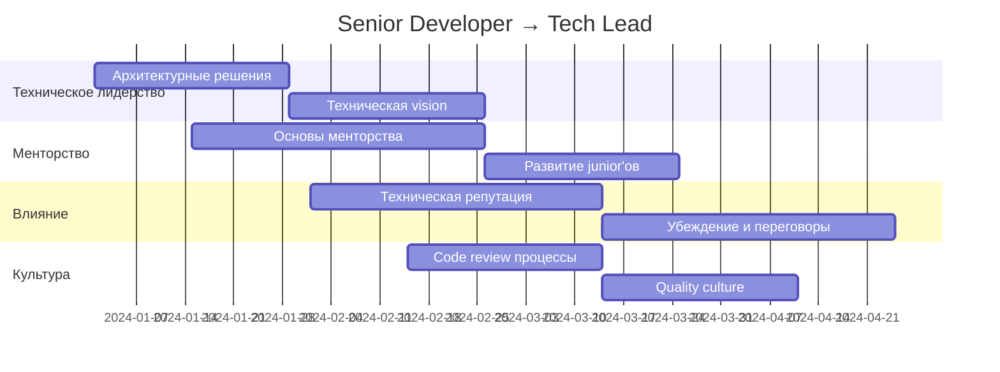
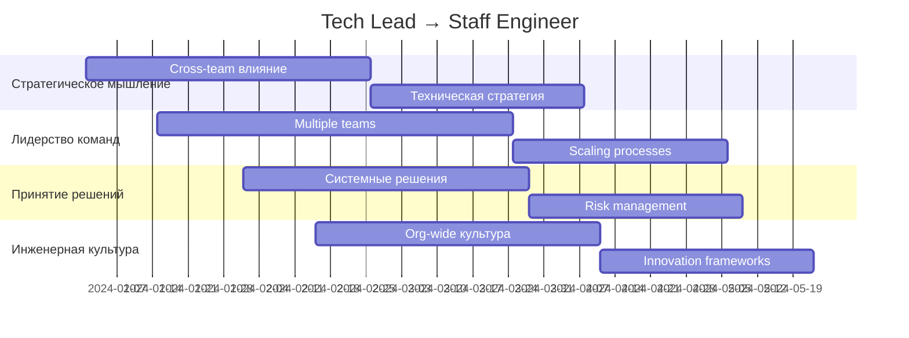
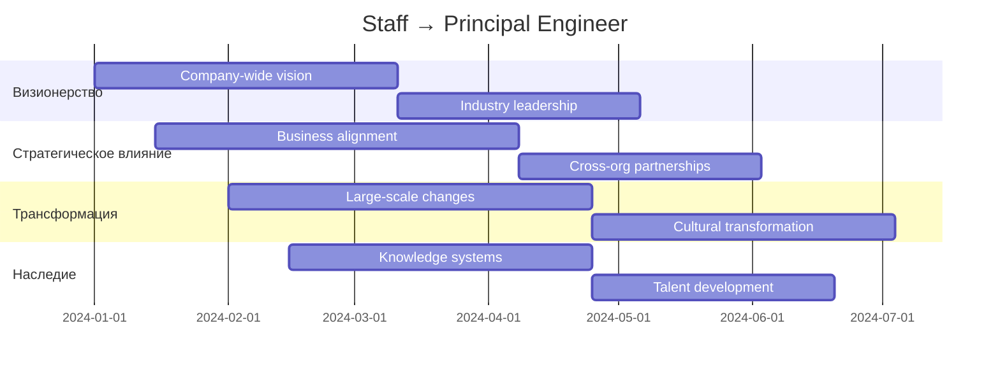

# 🎯 Senior Leadership для разработчиков

Комплексное руководство по развитию лидерских навыков для Senior Developer и выше.

## 📚 Структура обучения

### 🗂️ Модули

| Модуль | Описание | Сложность | Время изучения |
|--------|----------|-----------|----------------|
| [[technical-leadership\|🏗️ Техническое лидерство]] | Архитектурные решения, техническая vision | ⭐⭐⭐ | 8-12 недель |
| [[team-mentoring\|👥 Менторство и команда]] | Развитие людей, эмоциональный интеллект | ⭐⭐⭐⭐ | 10-16 недель |
| [[influence-decision-making\|🎪 Влияние и решения]] | Влияние без власти, принятие решений | ⭐⭐⭐⭐⭐ | 12-20 недель |
| [[engineering-culture\|🌟 Инженерная культура]] | Построение культуры, процессы | ⭐⭐⭐ | 6-10 недель |
| [[conflict-management\|⚖️ Управление конфликтами]] | Разрешение конфликтов, коммуникация | ⭐⭐⭐⭐ | 8-14 недель |

---

## 🎯 Траектории обучения по ролям

### 🚀 Senior Developer → Tech Lead (16-24 недели)



**Ключевые этапы:**
1. **Месяц 1-2**: Освоение архитектурного мышления
2. **Месяц 2-3**: Начало менторства junior разработчиков
3. **Месяц 3-4**: Развитие влияния через техническую экспертизу
4. **Месяц 4-6**: Построение процессов качества

### 🎖️ Tech Lead → Staff Engineer (20-28 недель)



**Ключевые этапы:**
1. **Месяц 1-3**: Расширение влияния на несколько команд
2. **Месяц 3-5**: Разработка технической стратегии
3. **Месяц 5-6**: Создание organization-wide процессов
4. **Месяц 6-7**: Внедрение инновационных подходов

### 👑 Staff Engineer → Principal Engineer (24-36 недель)



**Ключевые этапы:**
1. **Месяц 1-3**: Формирование видения на уровне компании
2. **Месяц 3-6**: Выстраивание бизнес-альянсов
3. **Месяц 6-9**: Проведение крупных трансформаций
4. **Месяц 9-12**: Создание систем знаний и развития талантов

---

## 📊 Метрики развития лидерства

### 🎯 KPI по уровням

| Уровень | Техническое влияние | Команда | Организация | Индустрия |
|---------|-------------------|---------|-------------|-----------|
| **Senior** | Проект/команда | 3-5 человек | Отдел | - |
| **Tech Lead** | Множество проектов | 5-10 человек | Дивизион | Конференции |
| **Staff** | Platform/продукт | 10-20 человек | Компания | Open Source |
| **Principal** | Архитектура компании | 20+ человек | Индустрия | Thought Leader |

### 📈 Оценка прогресса

```python
class LeadershipProgressTracker:
    def __init__(self):
        self.metrics = {
            'technical_influence': {
                'scope': 'Масштаб технического влияния',
                'scale': ['project', 'team', 'department', 'division', 'company'],
                'weight': 0.3
            },
            'people_development': {
                'scope': 'Развитие людей',
                'scale': ['mentee', 'team', 'multiple_teams', 'org_wide', 'industry'],
                'weight': 0.25
            },
            'decision_making': {
                'scope': 'Принятие решений',
                'scale': ['tactical', 'project', 'strategic', 'architectural', 'vision'],
                'weight': 0.25
            },
            'culture_building': {
                'scope': 'Построение культуры',
                'scale': ['team_practices', 'department', 'division', 'company', 'industry'],
                'weight': 0.2
            }
        }
    
    def calculate_leadership_level(self, scores):
        weighted_score = sum(
            scores[metric] * details['weight'] 
            for metric, details in self.metrics.items()
        )
        
        if weighted_score >= 4.0:
            return 'Principal Engineer'
        elif weighted_score >= 3.0:
            return 'Staff Engineer'
        elif weighted_score >= 2.0:
            return 'Tech Lead'
        else:
            return 'Senior Developer'
```

---

## 🎓 Практические проекты

### 🥉 Начальный уровень (Senior Developer)

**Проект 1: Техническое лидерство в команде**
- Провести архитектурный ревью существующей системы
- Предложить план технических улучшений
- Получить buy-in от команды и менеджмента

**Проект 2: Менторство junior разработчика**
- Взять junior'а под менторство на 3 месяца
- Создать план развития
- Измерить прогресс и результаты

### 🥈 Средний уровень (Tech Lead)

**Проект 3: Cross-team техническая инициатива**
- Провести техническую инициативу между командами
- Выстроить консенсус между stakeholders
- Реализовать и измерить impact

**Проект 4: Процесс качества**
- Внедрить новый процесс качества в отделе
- Обучить команды и измерить adoption
- Создать метрики и reporting

### 🥇 Продвинутый уровень (Staff+)

**Проект 5: Техническая стратегия**
- Разработать 2-летнюю техническую стратегию
- Получить alignment с бизнес-целями
- Создать roadmap и execution план

**Проект 6: Культурная трансформация**
- Провести культурную трансформацию в организации
- Измерить изменения в engagement и productivity
- Создать sustainable practices

---

## 🛠️ Рекомендуемый технологический стек

### 📊 Инструменты лидера

| Категория | Инструменты | Назначение |
|-----------|-------------|------------|
| **Communication** | Slack, Teams, Notion | Коммуникация и документация |
| **Decision Making** | MIRO, Figma, LucidChart | Визуализация и планирование |
| **Metrics** | Tableau, Grafana, DataDog | Измерение и мониторинг |
| **Development** | GitHub, GitLab, Jira | Процессы разработки |
| **Knowledge** | Confluence, Obsidian | База знаний |

### 🎯 Soft Skills Tools

```python
class LeadershipToolbox:
    def __init__(self):
        self.frameworks = {
            'decision_making': [
                'DACI (Driver, Approver, Contributors, Informed)',
                'RACI (Responsible, Accountable, Consulted, Informed)',
                'Six Thinking Hats',
                'Decision Trees'
            ],
            'communication': [
                'PREP (Point, Reason, Example, Point)',
                'Pyramid Principle',
                'Crucial Conversations',
                'Active Listening'
            ],
            'conflict_resolution': [
                'Thomas-Kilmann Model',
                'Interest-Based Problem Solving',
                'Crucial Accountability',
                'Nonviolent Communication'
            ],
            'team_building': [
                'Tuckman Model',
                'Situational Leadership',
                'Team Canvas',
                'Retrospectives'
            ]
        }
```

---

## 📈 Метрики успеха и KPI

### 🎯 Количественные метрики

| Метрика | Senior | Tech Lead | Staff | Principal |
|---------|--------|-----------|--------|-----------|
| **Team Velocity** | +10% | +20% | +30% | +40% |
| **Code Quality** | 85% coverage | 90% coverage | 95% coverage | Industry standard |
| **Retention** | Team stable | <10% turnover | <5% turnover | Talent magnet |
| **Delivery** | On time | Ahead of schedule | Predictable | Strategic impact |

### 📊 Качественные индикаторы

- **360° Feedback**: Регулярная обратная связь от команды
- **Peer Recognition**: Номинации и награды от коллег
- **Business Impact**: Влияние на бизнес-метрики
- **Industry Recognition**: Выступления, публикации, Open Source

---

## 🔗 Связанные разделы

- [[../senior-career-roadmap|Senior Career Roadmap]] - Карьерные траектории
- [[../management-skills|Management Skills]] - Управленческие навыки
- [[../../fundamentals/soft-skills|Soft Skills]] - Мягкие навыки
- [[../../technical-skills/system-design|System Design]] - Системное проектирование

---

## 📖 Дополнительные ресурсы

### 📚 Рекомендуемая литература

1. **"The Manager's Path"** - Camille Fournier
2. **"Staff Engineer"** - Will Larson  
3. **"Radical Candor"** - Kim Scott
4. **"The Culture Code"** - Daniel Coyle
5. **"Crucial Conversations"** - Kerry Patterson

### 🎥 Курсы и конференции

- **LeadDev** - Конференции для tech leaders
- **QCon** - Архитектура и лидерство
- **Coursera Leadership** - Специализация по лидерству
- **LinkedIn Learning** - Tech leadership курсы

---

*Успешное лидерство в tech - это баланс между технической экспертизой и человеческими навыками. Развивайте и то, и другое систематически!* 🚀 