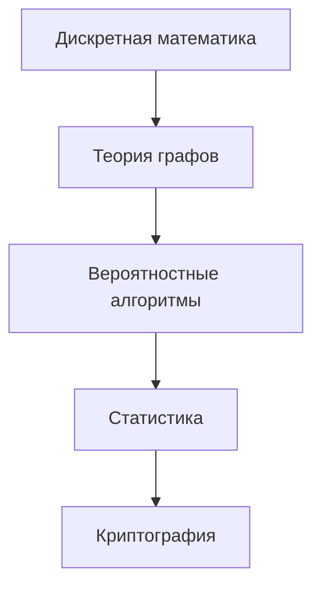
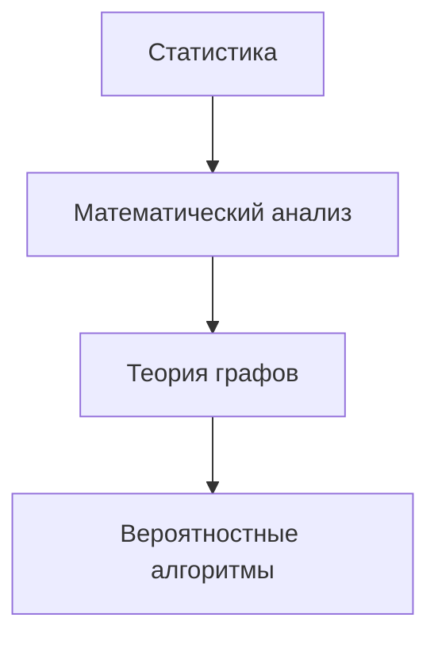
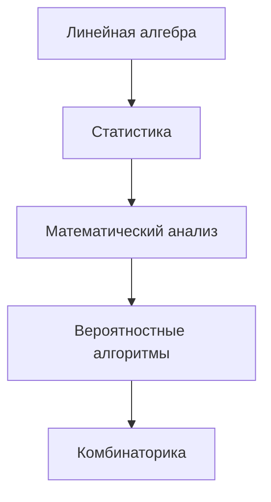
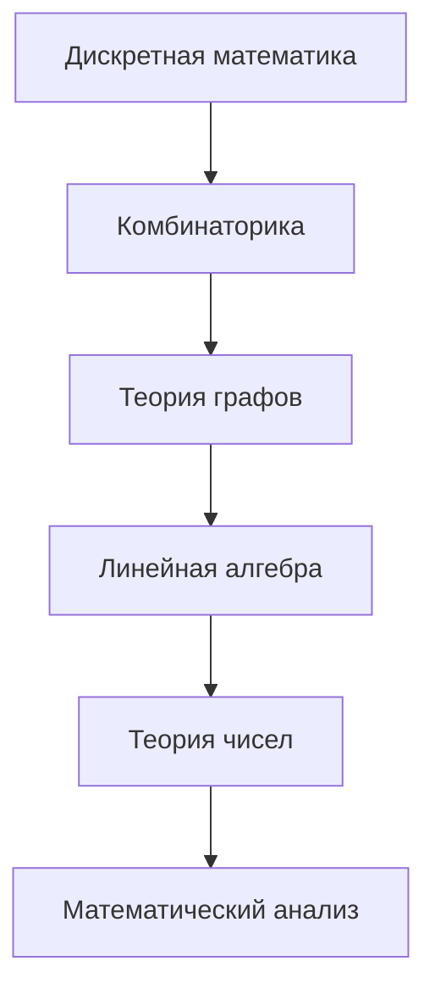
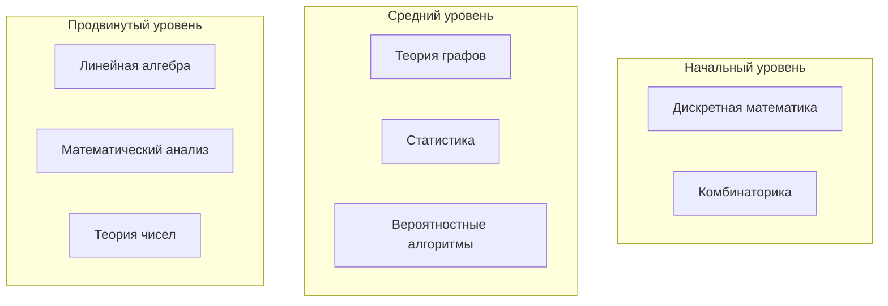

# Связь математики и алгоритмов 🔗

> **Навигация**: [[../README|← Математика]] | [[../../README|🏠 Главная]]

## 🎯 О разделе

Этот раздел исследует глубокие связи между **математическими концепциями** и **алгоритмическими решениями**. Каждая тема показывает, как абстрактные математические идеи превращаются в практические инструменты разработки.

---

## 📚 Тематические разделы

### 1️⃣ Фундаментальные основы

| Раздел | Описание | Сложность | Время изучения |
|--------|----------|-----------|----------------|
| [[discrete-mathematics-algorithms\|🔢 Дискретная математика]] | Битовые операции, динамическое программирование | ⭐⭐ | 2-3 недели |
| [[graph-theory-structures\|🕸️ Теория графов]] | Алгоритмы обхода, кратчайшие пути | ⭐⭐⭐ | 3-4 недели |
| [[linear-algebra-computation\|🔢 Линейная алгебра]] | Матричные операции, SVD, PageRank | ⭐⭐⭐⭐ | 4-6 недель |

### 2️⃣ Специализированные применения

| Раздел | Описание | Сложность | Время изучения |
|--------|----------|-----------|----------------|
| [[probability-randomized-algorithms\|🎲 Вероятностные алгоритмы]] | Рандомизация, хеширование, фильтры Блума | ⭐⭐⭐ | 3-4 недели |
| [[calculus-optimization\|📈 Математический анализ]] | Численные методы, градиентная оптимизация | ⭐⭐⭐⭐ | 4-5 недель |
| [[number-theory-cryptography\|🔐 Теория чисел]] | Модульная арифметика, RSA, криптография | ⭐⭐⭐⭐ | 4-6 недель |

### 3️⃣ Анализ и генерация

| Раздел | Описание | Сложность | Время изучения |
|--------|----------|-----------|----------------|
| [[statistics-data-analysis\|📊 Статистика]] | A/B тесты, анализ данных, временные ряды | ⭐⭐⭐ | 3-4 недели |
| [[combinatorics-generation\|🎯 Комбинаторика]] | Генерация комбинаций, числа Каталана | ⭐⭐⭐ | 2-3 недели |

---

## 🚀 Траектории изучения

### Backend-разработчик (12-16 недель)

**Приоритеты:**
1. [[discrete-mathematics-algorithms|Дискретная математика]] - основа алгоритмического мышления
2. [[graph-theory-structures|Теория графов]] - для систем и архитектуры
3. [[probability-randomized-algorithms|Вероятностные алгоритмы]] - для масштабируемых решений
4. [[statistics-data-analysis|Статистика]] - для аналитики и мониторинга
5. [[number-theory-cryptography|Криптография]] - для безопасности

### DevOps/SRE (8-10 недель)

**Приоритеты:**
1. [[statistics-data-analysis|Статистика]] - мониторинг и анализ метрик
2. [[calculus-optimization|Математический анализ]] - оптимизация производительности
3. [[graph-theory-structures|Теория графов]] - топология сети, зависимости
4. [[probability-randomized-algorithms|Вероятностные алгоритмы]] - распределение нагрузки

### Data Engineer (14-18 недель)

**Приоритеты:**
1. [[linear-algebra-computation|Линейная алгебра]] - обработка больших данных
2. [[statistics-data-analysis|Статистика]] - анализ и качество данных
3. [[calculus-optimization|Математический анализ]] - оптимизация пайплайнов
4. [[probability-randomized-algorithms|Вероятностные алгоритмы]] - сэмплирование
5. [[combinatorics-generation|Комбинаторика]] - генерация тестовых данных

### Алгоритмист (16-20 недель)

**Полный курс:** Все разделы в логической последовательности

---

## 🛠️ Практические проекты

### Уровень 1: Основы (2-4 недели каждый)

| Проект | Технологии | Математические концепции |
|--------|------------|---------------------------|
| **Система кэширования** | Redis, Python | [[discrete-mathematics-algorithms\|Битовые операции]], хеширование |
| **Граф зависимостей** | GraphQL, Node.js | [[graph-theory-structures\|Топологическая сортировка]] |
| **A/B тест платформа** | Flask, PostgreSQL | [[statistics-data-analysis\|Статистические тесты]] |

### Уровень 2: Промежуточный (4-6 недель каждый)

| Проект | Технологии | Математические концепции |
|--------|------------|---------------------------|
| **Рекомендательная система** | Spark, ML | [[linear-algebra-computation\|SVD]], корреляции |
| **Балансировщик нагрузки** | Go, Docker | [[probability-randomized-algorithms\|Consistent hashing]] |
| **Система мониторинга** | Prometheus, Grafana | [[calculus-optimization\|Численные методы]], временные ряды |

### Уровень 3: Продвинутый (6-8 недель каждый)

| Проект | Технологии | Математические концепции |
|--------|------------|---------------------------|
| **Распределенная БД** | Cassandra, Raft | [[number-theory-cryptography\|Криптографические хеши]] |
| **Поисковая система** | Elasticsearch, ML | [[linear-algebra-computation\|TF-IDF]], PageRank |
| **Биржевая платформа** | Kafka, Redis | [[statistics-data-analysis\|Временные ряды]], оптимизация |

---

## 🎯 Чек-листы навыков

### 🔢 Дискретная математика ✅
- [ ] Битовые операции и маски
- [ ] Динамическое программирование
- [ ] Рекуррентные соотношения
- [ ] Применение в алгоритмах поиска
- [ ] Оптимизация памяти

### 🕸️ Теория графов ✅
- [ ] BFS/DFS реализация
- [ ] Алгоритмы кратчайших путей
- [ ] Минимальные остовные деревья
- [ ] Топологическая сортировка
- [ ] Применение в системной архитектуре

### 🔢 Линейная алгебра ✅
- [ ] Матричные операции
- [ ] Собственные векторы
- [ ] SVD разложение
- [ ] PageRank алгоритм
- [ ] Применение в ML

### 🎲 Вероятностные алгоритмы ✅
- [ ] Рандомизированные структуры данных
- [ ] Consistent hashing
- [ ] Фильтры Блума
- [ ] Monte Carlo методы
- [ ] Применение в распределенных системах

### 📈 Математический анализ ✅
- [ ] Численное дифференцирование
- [ ] Методы оптимизации
- [ ] Градиентный спуск
- [ ] Анализ сложности
- [ ] Применение в ML/DL

### 🔐 Теория чисел ✅
- [ ] Модульная арифметика
- [ ] Алгоритм Евклида
- [ ] Быстрое возведение в степень
- [ ] RSA криптография
- [ ] Хеш-функции

### 📊 Статистика ✅
- [ ] Дескриптивная статистика
- [ ] A/B тестирование
- [ ] Временные ряды
- [ ] Корреляционный анализ
- [ ] Применение в аналитике

### 🎯 Комбинаторика ✅
- [ ] Генерация перестановок
- [ ] Алгоритмы на подмножествах
- [ ] Числа Каталана
- [ ] Код Грея
- [ ] Применение в тестировании

---

## 📊 Сравнение сложности тем

| Уровень | Математическая сложность | Алгоритмическая сложность | Применимость |
|---------|-------------------------|---------------------------|--------------|
| **Начальный** | ⭐⭐ | ⭐⭐ | 🔥🔥🔥 Высокая |
| **Средний** | ⭐⭐⭐ | ⭐⭐⭐ | 🔥🔥 Средняя |
| **Продвинутый** | ⭐⭐⭐⭐ | ⭐⭐⭐⭐ | 🔥 Специализированная |

---

## 🌟 Трендовые направления 2024

### 🚀 Горячие темы
- **Quantum algorithms**: Квантовые аналоги классических алгоритмов
- **ML/AI optimization**: Математическая оптимизация для обучения моделей
- **Distributed consensus**: Математические основы блокчейна
- **Privacy-preserving computation**: Гомоморфное шифрование

### 📈 Растущий спрос
- **Statistical analysis**: Data-driven решения
- **Graph algorithms**: Социальные сети, рекомендации
- **Numerical optimization**: High-performance computing
- **Cryptography**: Кибербезопасность

---

## 🔗 Связанные разделы

### Внутренние связи
- [[../probability-statistics/README|📊 Вероятности и статистика]] - статистические методы
- [[../discrete-mathematics/README|🔢 Дискретная математика]] - фундаментальные основы
- [[../linear-algebra/README|📐 Линейная алгебра]] - матричные вычисления

### Внешние связи
- [[../../algorithms-data-structures/README|🧮 Алгоритмы и структуры данных]] - практическая реализация
- [[../../computer-science/computational-complexity/README|⏱️ Сложность вычислений]] - анализ эффективности
- [[../../databases/optimization/README|🗄️ Оптимизация БД]] - математические методы в БД

---

## 📚 Рекомендуемые ресурсы

### 📖 Книги
- **"Concrete Mathematics"** - Knuth, Graham, Patashnik
- **"Introduction to Algorithms"** - Cormen, Leiserson, Rivest, Stein
- **"The Art of Computer Programming"** - Donald Knuth
- **"Mathematics for Computer Science"** - Lehman, Leighton, Meyer

### 🎓 Онлайн курсы
- **MIT 6.042J** - Mathematics for Computer Science
- **Stanford CS161** - Design and Analysis of Algorithms  
- **Stanford CS109** - Introduction to Probability for Computer Scientists
- **MIT 18.06** - Linear Algebra

### 💻 Практические ресурсы
- **Project Euler** - математические задачи программирования
- **Codeforces** - алгоритмические соревнования
- **LeetCode** - задачи с математическим уклоном
- **Kaggle** - машинное обучение и анализ данных

### 🛠️ Инструменты
- **Python**: NumPy, SciPy, SymPy
- **R**: статистический анализ
- **Mathematica/Wolfram**: символьные вычисления
- **MATLAB**: численные методы

---

> 💡 **Совет**: Начните с тем, которые непосредственно применимы в вашей текущей работе, затем расширяйте знания в смежные области. Математика - это инструмент, а не самоцель!

**Общее время изучения**: 12-20 недель в зависимости от выбранной траектории  
**Последнее обновление**: Декабрь 2024 