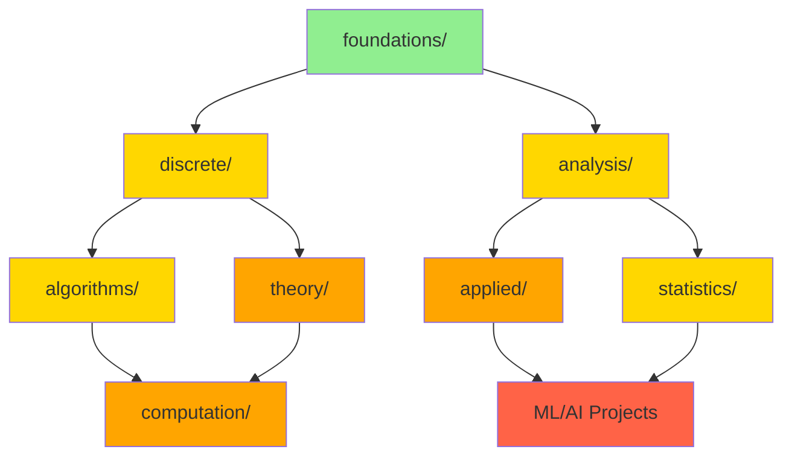

# 📐 Обзор структуры математики

## 🎯 Новая файловая организация

### 📁 **Структура папок**

```
mathematics/
├── 📚 foundations/               # Основы математики
│   ├── programming-math.md       # Базовая математика
│   └── README.md                 # Описание раздела
│
├── 📈 analysis/                  # Анализ и исчисление
│   ├── mathematical-analysis.md   # Пределы, производные, интегралы
│   ├── numerical-methods.md      # Численные методы
│   └── README.md                 # Описание раздела
│
├── 🔢 discrete/                  # Дискретная математика
│   ├── discrete-mathematics.md    # Графы, комбинаторика
│   ├── algebraic-structures.md    # Группы, кольца, поля
│   └── README.md                 # Описание раздела
│
├── 🛠️ applied/                   # Прикладные разделы
│   ├── physics-fundamentals.md    # Физические основы
│   ├── computational-geometry.md  # Вычислительная геометрия
│   ├── optimization.md           # Оптимизация
│   └── README.md                 # Описание раздела
│
├── 🧠 theory/                    # Теоретические основы
│   ├── mathematical-logic.md      # Математическая логика
│   ├── information-theory.md      # Теория информации
│   └── README.md                 # Описание раздела
│
├── 🧮 algorithms/                # Алгоритмические методы
│   ├── calculus-optimization.md   # Оптимизация
│   ├── combinatorics-generation.md # Комбинаторные алгоритмы
│   ├── discrete-mathematics-algorithms.md # Дискретные алгоритмы
│   ├── graph-theory-structures.md # Графовые алгоритмы
│   ├── linear-algebra-computation.md # Линейная алгебра
│   ├── number-theory-cryptography.md # Теория чисел
│   ├── probability-randomized-algorithms.md # Вероятностные алгоритмы
│   ├── statistics-data-analysis.md # Статистический анализ
│   └── README.md                 # Описание раздела
│
├── 📊 statistics/                # Статистика и вероятность
│   ├── probability-theory.md      # Теория вероятностей
│   ├── descriptive-statistics.md  # Описательная статистика
│   ├── bayesian-statistics.md     # Байесовская статистика
│   ├── time-series.md            # Временные ряды
│   ├── statistical-tests.md      # Статистические тесты
│   ├── advanced-methods.md       # Продвинутые методы
│   ├── survival-analysis.md      # Анализ выживаемости
│   ├── practical-applications.md # Практические применения
│   └── README.md                 # Описание раздела
│
├── 💻 computation/               # Теория вычислений
│   ├── automata.md               # Теория автоматов
│   ├── complexity-theory.md      # Теория сложности
│   ├── computability.md          # Теория вычислимости
│   ├── formal-languages-grammars.md # Формальные языки
│   ├── lambda-calculus.md        # Лямбда-исчисление
│   ├── compilers-parsers.md      # Компиляторы
│   ├── regular-expressions.md    # Регулярные выражения
│   └── README.md                 # Описание раздела
│
├── README.md                     # Главная страница
├── index.md                      # Индекс разделов
└── structure-overview.md         # Этот файл
```

---

## 📊 **Статистика разделов**

| Папка | Файлов | Формул | Примеров | Сложность |
|-------|--------|--------|----------|-----------|
| **foundations/** | 1 | 50+ | 20+ | 🟢 Низкая |
| **analysis/** | 2 | 100+ | 50+ | 🟡 Средняя |
| **discrete/** | 2 | 150+ | 60+ | 🟡 Средняя |
| **applied/** | 3 | 120+ | 40+ | 🟠 Высокая |
| **theory/** | 2 | 80+ | 30+ | 🟠 Высокая |
| **algorithms/** | 8 | 200+ | 100+ | 🟡 Средняя |
| **statistics/** | 8 | 150+ | 80+ | 🟡 Средняя |
| **computation/** | 7 | 100+ | 40+ | 🟠 Высокая |

---

## 🗺️ **Карта зависимостей**

### **Уровень 1: Основы**
```
foundations/ ── programming-math.md
```

### **Уровень 2: Фундаменты**
```
foundations/ ──┬── discrete/
               └── analysis/
```

### **Уровень 3: Специализация**
```
discrete/ ──┬── algorithms/
            └── theory/

analysis/ ──┬── applied/
            └── statistics/
```

### **Уровень 4: Применения**
```
algorithms/ ──┬── computation/
              └── Практические проекты

applied/ ──┬── ML/AI проекты
           └── Игры/Графика

statistics/ ──┬── Data Science
              └── Исследования
```

---

## 🎯 **Рекомендуемые пути изучения**

### 🚀 **Новичок → Программист**
```
foundations/ → discrete/ → algorithms/
```

### 🤖 **Программист → ML инженер**
```
foundations/ → analysis/ → statistics/ → applied/optimization.md
```

### 🎮 **Программист → Game Developer**
```
foundations/ → discrete/ → analysis/ → applied/physics-fundamentals.md
```

### 🔐 **Программист → Security Specialist**
```
foundations/ → discrete/ → discrete/algebraic-structures.md → theory/
```

### 🧠 **Программист → CS Researcher**
```
foundations/ → discrete/ → algorithms/ → theory/ → computation/
```

---

## 📈 **Прогресс изучения**

### **Этап 1: Базовый (4-6 недель)**
- [ ] foundations/programming-math.md
- [ ] discrete/discrete-mathematics.md (базовые части)

### **Этап 2: Развитие (8-12 недель)**
- [ ] analysis/mathematical-analysis.md
- [ ] algorithms/ (выборочно)
- [ ] statistics/probability-theory.md

### **Этап 3: Специализация (12-16 недель)**
- [ ] applied/ (по выбору)
- [ ] theory/ (по выбору)
- [ ] computation/ (по выбору)

---

## 🔧 **Инструменты навигации**

### **Быстрая навигация**
- **[Главная страница](./README.md)** - Обзор всех разделов
- **[Индекс](./index.md)** - Полный список файлов
- **[Структура](./structure-overview.md)** - Этот файл

### **Навигация по папкам**
- **[foundations/](./foundations/)** - Основы математики
- **[analysis/](./analysis/)** - Анализ и исчисление
- **[discrete/](./discrete/)** - Дискретная математика
- **[applied/](./applied/)** - Прикладные разделы
- **[theory/](./theory/)** - Теоретические основы
- **[algorithms/](./algorithms/)** - Алгоритмические методы
- **[statistics/](./statistics/)** - Статистика и вероятность
- **[computation/](./computation/)** - Теория вычислений

---

## 💡 **Преимущества новой структуры**

### ✅ **Организация**
- Логическая группировка по темам
- Четкая иерархия сложности
- Удобная навигация

### ✅ **Масштабируемость**
- Легко добавлять новые файлы
- Простое обслуживание
- Гибкие пути изучения

### ✅ **Практичность**
- Быстрый поиск нужных тем
- Понятная структура для обучения
- Удобные README в каждой папке

---

## 🔄 **Взаимосвязи разделов**



---

*Новая структура обеспечивает логичную организацию и удобную навигацию по математическим разделам.* 