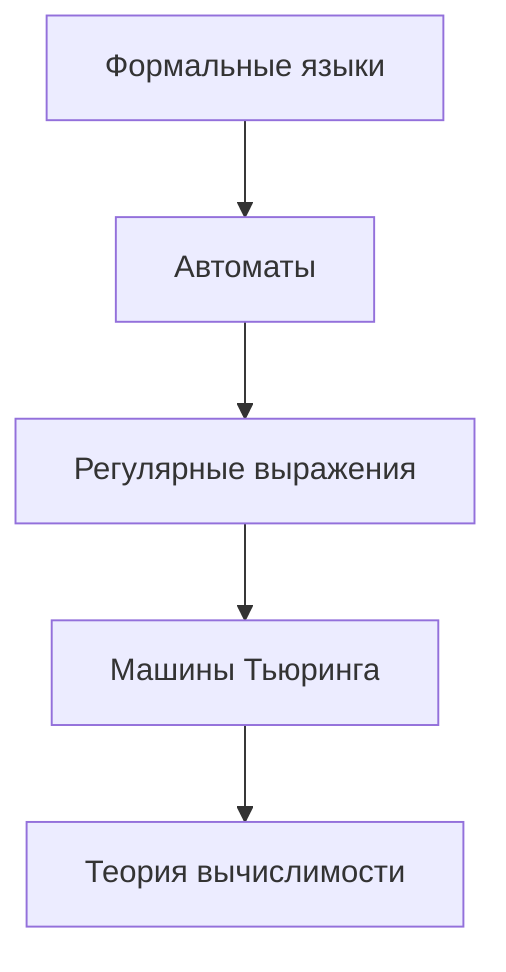
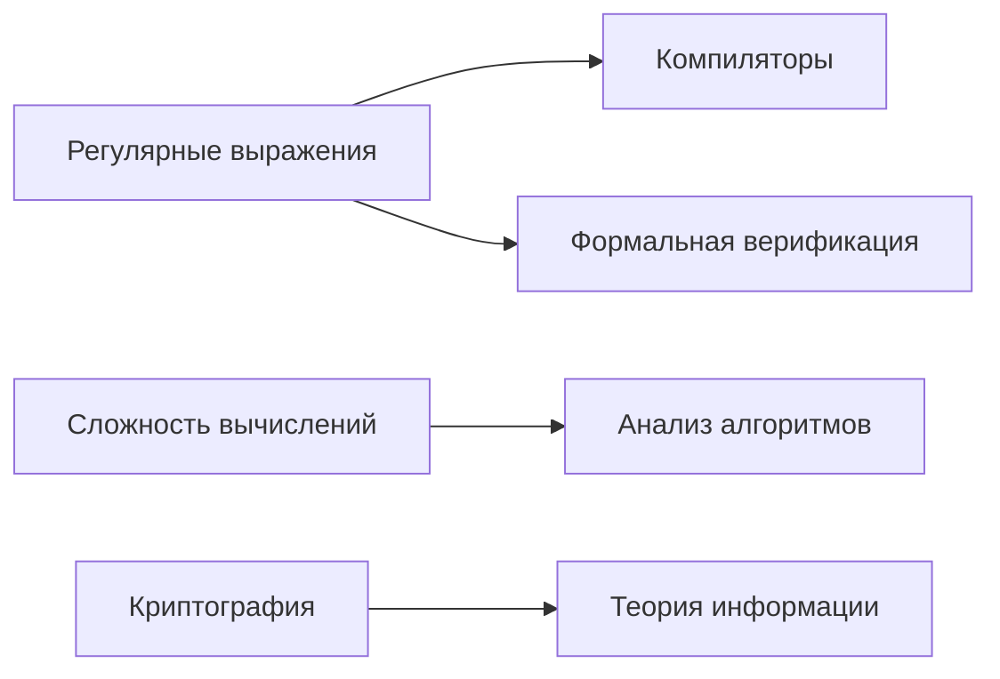
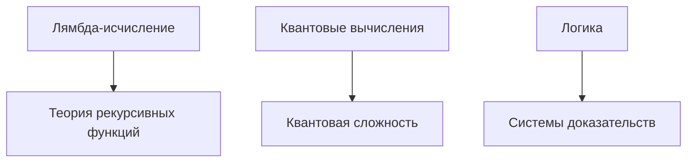

# Теория вычислений

> **Математические основы информатики**  
> Автоматы, формальные языки, вычислимость и сложность алгоритмов

## 🎯 Зачем изучать теорию вычислений?

### 🔑 Критическая важность
- **[[Компиляторы|Компиляторы]]** - понимание синтаксических анализаторов
- **[[Анализ алгоритмов|Алгоритмы]]** - оценка сложности и эффективности  
- **[[Криптография|Безопасность]]** - криптографические протоколы
- **[[Формальная верификация|Системы]]** - формальная верификация
- **[[Машинное обучение|AI/ML]]** - теоретические основы машинного обучения

### 💼 Практическое применение
```
Ежедневные задачи программиста:
├── [[Регулярные выражения]] (поиск в тексте)
├── [[Формальные языки и грамматики|Парсинг]] (JSON, XML, языки программирования)
├── [[Автоматы|Валидация]] (форматы данных, протоколы)
├── [[Сложность вычислений|Оптимизация]] (анализ сложности алгоритмов)
├── [[Формальная верификация|Тестирование]] (модельная проверка)
└── [[Формальные методы в разработке|Архитектура]] (формальные спецификации)
```

---

## 📚 Карта знаний

### 🎯 Основы
1. **[[Формальные языки и грамматики]]** - алфавиты, языки, иерархия Хомского
2. **[[Автоматы]]** - конечные автоматы, магазинные автоматы
3. **[[Регулярные выражения]]** - паттерны, NFA, DFA преобразования

### 🚀 Продвинутые темы
4. **[[Машины Тьюринга]]** - универсальная модель вычислений
5. **[[Теория вычислимости]]** - проблема остановки, разрешимость
6. **[[Сложность вычислений]]** - P, NP, классы сложности
7. **[[Лямбда-исчисление]]** - функциональная модель вычислений
8. **[[Теория рекурсивных функций]]** - примитивная и μ-рекурсия

### 🔬 Специализированные разделы
9. **[[Квантовые вычисления]]** - квантовые алгоритмы и сложность
10. **[[Формальная верификация]]** - model checking, дедуктивная верификация
11. **[[Теория информации]]** - энтропия, сжатие, кодирование
12. **[[Логика и системы доказательств]]** - пропозициональная логика, резолюция

### 💼 Практические применения
13. **[[Компиляторы и парсеры]]** - лексический и синтаксический анализ
14. **[[Анализ алгоритмов]]** - асимптотическая сложность
15. **[[Криптография]]** - теоретико-числовые основы
16. **[[Формальные методы в разработке]]** - спецификация систем

---

## 🗺️ Траектории изучения

### 🟢 Для начинающих


**Рекомендуемый порядок:**
1. [[Формальные языки и грамматики]] → понимание основ
2. [[Автоматы]] → практические модели распознавания
3. [[Регулярные выражения]] → применение в программировании
4. [[Машины Тьюринга]] → универсальная модель
5. [[Теория вычислимости]] → теоретические границы

### 🟡 Для практиков


**Фокус на применении:**
1. [[Регулярные выражения]] + [[Компиляторы и парсеры]]
2. [[Сложность вычислений]] + [[Анализ алгоритмов]]
3. [[Формальная верификация]] + [[Формальные методы в разработке]]

### 🔴 Для исследователей


**Углубленные темы:**
1. [[Лямбда-исчисление]] → [[Теория рекурсивных функций]]
2. [[Квантовые вычисления]] → новые парадигмы
3. [[Логика и системы доказательств]] → формальные основы

---

## 🎓 Практические задания

### 📝 Начальный уровень
- [ ] Реализовать DFA для проверки четности двоичного числа
- [ ] Построить регулярное выражение для email валидации
- [ ] Написать простой лексический анализатор

### 🔧 Средний уровень  
- [ ] Создать парсер арифметических выражений
- [ ] Реализовать алгоритм минимизации DFA
- [ ] Построить машину Тьюринга для сложения чисел

### 🚀 Продвинутый уровень
- [ ] Доказать NP-полноту задачи
- [ ] Реализовать model checker для простых систем
- [ ] Изучить квантовый алгоритм Шора

---

## 🔗 Связанные разделы

- **[[Алгоритмы и структуры данных]]** - практическое применение теории
- **[[Математический анализ]]** - основы для анализа сложности
- **[[Дискретная математика]]** - логика и комбинаторика
- **[[Программирование]]** - реализация теоретических концепций

---

## 📖 Рекомендуемая литература

### 📚 Основные источники
- **Хопкрофт, Мотвани, Ульман** - "Введение в теорию автоматов, языков и вычислений"
- **Сипсер** - "Введение в теорию вычислений"
- **Пападимитриу** - "Вычислительная сложность"

### 🌐 Онлайн ресурсы
- [MIT OpenCourseWare - Theory of Computation](https://ocw.mit.edu)
- [Stanford CS154 - Automata and Complexity Theory](https://web.stanford.edu/class/cs154/)
- [Complexity Zoo](https://complexityzoo.net/Complexity_Zoo) - энциклопедия классов сложности

---

*Изучение теории вычислений - это инвестиция в глубокое понимание возможностей и ограничений компьютерных наук* 🧠✨ 