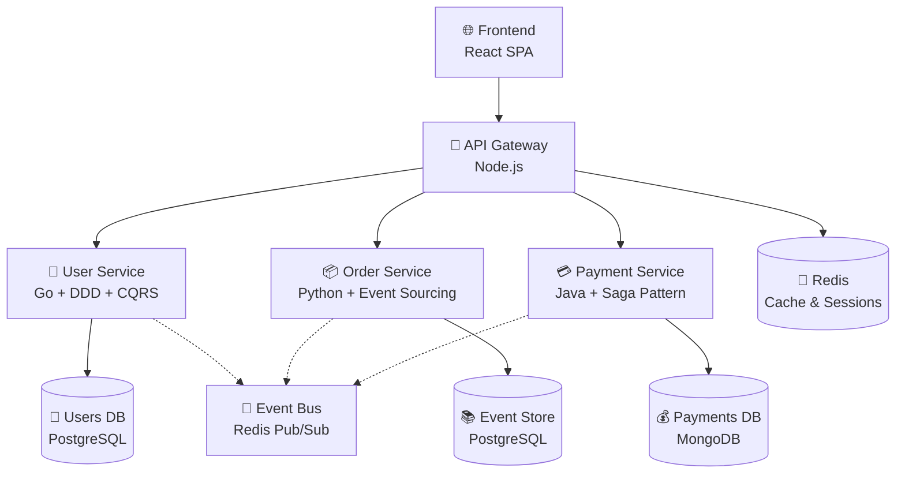

# 🏗️ Микросервисная архитектура

## 📝 Описание

Коллекция документации по микросервисной архитектуре, демонстрирующая современные архитектурные паттерны и подходы к проектированию распределенных систем.

---

## 🎯 Архитектура системы

---

## 📚 Документация сервисов

### 🔗 Основные сервисы

- **[[user-service]]** - Управление пользователями (Go + DDD + CQRS)
- **[[order-service]]** - Управление заказами (Python + Event Sourcing)  
- **[[api-gateway]]** - API Gateway (Node.js + GraphQL)

### 🔗 Архитектурные паттерны

- **[[microservices-patterns]]** - Паттерны микросервисов
- **[[event-driven-architecture]]** - Событийно-ориентированная архитектура
- **[[distributed-systems]]** - Распределенные системы

### 🔗 Технические аспекты

- **[[service-communication]]** - Взаимодействие сервисов
- **[[data-management]]** - Управление данными
- **[[monitoring-observability]]** - Мониторинг и наблюдаемость

---

## 🚀 Ключевые концепции

### Domain-Driven Design (DDD)
- Моделирование бизнес-домена
- Агрегаты и сущности
- Доменные события
- Bounded Context

### Command Query Responsibility Segregation (CQRS)
- Разделение команд и запросов
- Separate models для чтения и записи
- Event Sourcing интеграция

### Event Sourcing
- Хранение событий как источник истины
- Восстановление состояния из событий
- Temporal queries
- Event versioning

### Microservices Patterns
- API Gateway
- Service Discovery
- Circuit Breaker
- Saga Pattern
- Event-driven communication

---

## 🔧 Технологический стек

### Backend Services
- **Go** - User Service (высокая производительность)
- **Python** - Order Service (быстрая разработка)
- **Node.js** - API Gateway (единый язык с фронтендом)

### Databases
- **PostgreSQL** - ACID транзакции, SQL
- **Redis** - Кеширование, сессии, pub/sub
- **MongoDB** - Документо-ориентированные данные

### Infrastructure
- **Docker** - Контейнеризация
- **Kubernetes** - Оркестрация
- **nginx** - Load balancing
- **Prometheus** - Мониторинг

---

## 📖 Связанные темы

- [[../architecture/microservices-architecture|Архитектура микросервисов]]
- [[../backend/database-architecture|Архитектура баз данных]]
- [[../fundamentals/ddd-patterns|DDD паттерны]]
- [[../fundamentals/cqrs-pattern|CQRS паттерн]]
- [[../fundamentals/event-sourcing|Event Sourcing]]

---

## 🎓 Обучающие материалы

- [[microservices-learning-path|Путь изучения микросервисов]]
- [[distributed-systems-concepts|Концепции распределенных систем]]
- [[event-driven-patterns|Событийные паттерны]]
- [[performance-scalability|Производительность и масштабируемость]] 