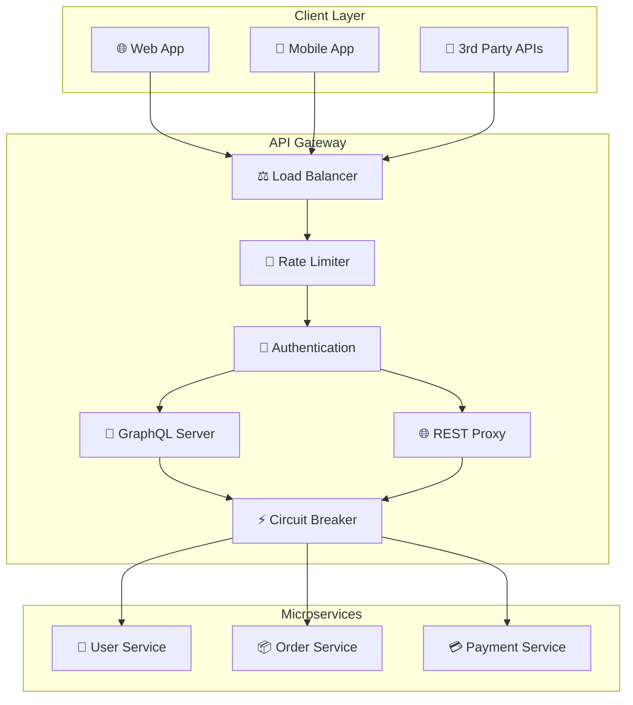

# 🚪 API Gateway - Node.js + GraphQL

## 📝 Описание

API Gateway как единая точка входа в микросервисную архитектуру, реализующий:
- **API Gateway Pattern** - централизованный вход
- **GraphQL Federation** - объединение схем
- **Backend for Frontend (BFF)** - адаптация под клиентов
- **Circuit Breaker** - устойчивость к сбоям

---

## 🏗️ Архитектура Gateway



### Структура проекта

```
api-gateway/
├── src/
│   ├── graphql/
│   │   ├── schema.js          # 🔄 GraphQL Schema Federation
│   │   ├── resolvers/         # 🎯 Resolvers для каждого сервиса
│   │   └── datasources/       # 📊 Data Sources
│   ├── rest/
│   │   ├── routes/            # 🛣️ REST API Routes
│   │   ├── proxy.js           # 🔄 Service Proxy
│   │   └── middleware/        # 🔧 Custom Middleware
│   ├── services/
│   │   ├── discovery.js       # 🔍 Service Discovery
│   │   ├── loadBalancer.js    # ⚖️ Load Balancing
│   │   └── circuitBreaker.js  # ⚡ Circuit Breaker
│   ├── auth/
│   │   ├── jwt.js            # 🔐 JWT Validation
│   │   ├── oauth.js          # 🔑 OAuth Integration
│   │   └── rbac.js           # 👮 Role-Based Access
│   └── monitoring/
│       ├── metrics.js        # 📊 Prometheus Metrics
│       ├── tracing.js        # 🔍 Distributed Tracing
│       └── logging.js        # 📝 Structured Logging
```

---

## 🔄 GraphQL Federation

### Unified Schema

```javascript
// GraphQL Schema Federation
const { buildFederatedSchema } = require('@apollo/federation');

const typeDefs = gql`
  # User Service Types
  type User @key(fields: "id") {
    id: ID!
    email: String!
    name: String!
    orders: [Order!]!
  }
  
  # Order Service Types  
  type Order @key(fields: "id") {
    id: ID!
    user: User!
    items: [OrderItem!]!
    status: OrderStatus!
    totalAmount: Float!
    createdAt: DateTime!
  }
  
  type OrderItem {
    productId: ID!
    quantity: Int!
    price: Float!
    totalPrice: Float!
  }
  
  enum OrderStatus {
    DRAFT
    CONFIRMED
    SHIPPED
    DELIVERED
    CANCELLED
  }
  
  # Root Types
  type Query {
    # User queries
    user(id: ID!): User
    users(limit: Int, offset: Int): [User!]!
    
    # Order queries
    order(id: ID!): Order
    orders(userId: ID, status: OrderStatus): [Order!]!
  }
  
  type Mutation {
    # User mutations
    createUser(input: CreateUserInput!): User!
    updateUser(id: ID!, input: UpdateUserInput!): User!
    
    # Order mutations
    createOrder(input: CreateOrderInput!): Order!
    addItemToOrder(orderId: ID!, input: AddItemInput!): Order!
    confirmOrder(orderId: ID!): Order!
  }
  
  type Subscription {
    orderStatusChanged(userId: ID!): Order!
    userActivity(userId: ID!): UserActivity!
  }
`;

const schema = buildFederatedSchema({
  typeDefs,
  resolvers: {
    Query: {
      user: (_, { id }, { dataSources }) => 
        dataSources.userService.getUser(id),
      orders: (_, args, { dataSources }) => 
        dataSources.orderService.getOrders(args),
    },
    
    Mutation: {
      createUser: (_, { input }, { dataSources }) =>
        dataSources.userService.createUser(input),
      createOrder: (_, { input }, { dataSources }) =>
        dataSources.orderService.createOrder(input),
    },
    
    // Cross-service resolvers
    User: {
      orders: (user, _, { dataSources }) =>
        dataSources.orderService.getOrdersByUserId(user.id),
    },
    
    Order: {
      user: (order, _, { dataSources }) =>
        dataSources.userService.getUser(order.userId),
    }
  }
});
```

### Data Sources

```javascript
class UserServiceDataSource extends RESTDataSource {
  constructor() {
    super();
    this.baseURL = process.env.USER_SERVICE_URL;
  }
  
  willSendRequest(request) {
    // Добавление аутентификации
    request.headers.set('Authorization', this.context.token);
    
    // Добавление trace ID для observability
    request.headers.set('X-Trace-ID', this.context.traceId);
  }
  
  async getUser(id) {
    try {
      const response = await this.get(`/users/${id}`);
      return this.userReducer(response);
    } catch (error) {
      if (error.extensions?.response?.status === 404) {
        return null;
      }
      throw error;
    }
  }
  
  async createUser(input) {
    const response = await this.post('/users', input);
    return this.userReducer(response);
  }
  
  userReducer(user) {
    return {
      id: user.id,
      email: user.email,
      name: user.name,
      createdAt: user.created_at,
      updatedAt: user.updated_at
    };
  }
}

class OrderServiceDataSource extends RESTDataSource {
  constructor() {
    super();
    this.baseURL = process.env.ORDER_SERVICE_URL;
  }
  
  async getOrders(args = {}) {
    const params = new URLSearchParams();
    if (args.userId) params.append('user_id', args.userId);
    if (args.status) params.append('status', args.status);
    
    const response = await this.get(`/orders?${params}`);
    return response.map(this.orderReducer);
  }
  
  async createOrder(input) {
    const response = await this.post('/orders', {
      user_id: input.userId
    });
    return this.orderReducer(response);
  }
  
  orderReducer(order) {
    return {
      id: order.id,
      userId: order.user_id,
      status: order.status.toUpperCase(),
      totalAmount: parseFloat(order.total_amount),
      items: order.items || [],
      createdAt: order.created_at
    };
  }
}
```

---

## 🌐 REST API Proxy

### Service Discovery

```javascript
class ServiceDiscovery {
  constructor() {
    this.services = new Map();
    this.healthChecks = new Map();
    this.logger = winston.createLogger();
  }
  
  async registerService(serviceName, instances) {
    this.services.set(serviceName, instances);
    
    // Запуск health checks
    for (const instance of instances) {
      this.startHealthCheck(serviceName, instance);
    }
    
    this.logger.info(`Registered service: ${serviceName}`, {
      instances: instances.length
    });
  }
  
  getHealthyInstances(serviceName) {
    const instances = this.services.get(serviceName) || [];
    return instances.filter(instance => instance.healthy !== false);
  }
  
  async startHealthCheck(serviceName, instance) {
    const checkHealth = async () => {
      try {
        const response = await axios.get(
          `${instance.url}${instance.healthPath || '/health'}`,
          { timeout: 5000 }
        );
        
        const wasHealthy = instance.healthy;
        instance.healthy = response.status === 200;
        
        if (!wasHealthy && instance.healthy) {
          this.logger.info(`Service instance recovered: ${serviceName}`, {
            url: instance.url
          });
        }
      } catch (error) {
        const wasHealthy = instance.healthy;
        instance.healthy = false;
        
        if (wasHealthy) {
          this.logger.error(`Service instance failed: ${serviceName}`, {
            url: instance.url,
            error: error.message
          });
        }
      }
    };
    
    // Проверка каждые 30 секунд
    setInterval(checkHealth, 30000);
    await checkHealth(); // Первоначальная проверка
  }
}
```

### Load Balancer

```javascript
class LoadBalancer {
  constructor(strategy = 'round-robin') {
    this.strategy = strategy;
    this.counters = new Map();
  }
  
  selectInstance(serviceName, instances) {
    const healthyInstances = instances.filter(i => i.healthy !== false);
    
    if (healthyInstances.length === 0) {
      throw new Error(`No healthy instances for service: ${serviceName}`);
    }
    
    switch (this.strategy) {
      case 'round-robin':
        return this.roundRobin(serviceName, healthyInstances);
      case 'weighted':
        return this.weighted(healthyInstances);
      case 'least-connections':
        return this.leastConnections(healthyInstances);
      default:
        return healthyInstances[0];
    }
  }
  
  roundRobin(serviceName, instances) {
    const counter = this.counters.get(serviceName) || 0;
    const selectedIndex = counter % instances.length;
    this.counters.set(serviceName, counter + 1);
    return instances[selectedIndex];
  }
  
  weighted(instances) {
    const totalWeight = instances.reduce((sum, i) => sum + (i.weight || 1), 0);
    let random = Math.random() * totalWeight;
    
    for (const instance of instances) {
      random -= (instance.weight || 1);
      if (random <= 0) {
        return instance;
      }
    }
    
    return instances[instances.length - 1];
  }
}
```

### Circuit Breaker

```javascript
class CircuitBreaker {
  constructor(options = {}) {
    this.failureThreshold = options.failureThreshold || 5;
    this.timeout = options.timeout || 60000; // 1 minute
    this.monitoringPeriod = options.monitoringPeriod || 10000; // 10 seconds
    
    this.state = 'CLOSED'; // CLOSED, OPEN, HALF_OPEN
    this.failures = 0;
    this.nextAttempt = Date.now();
    this.stats = {
      requests: 0,
      successes: 0,
      failures: 0
    };
  }
  
  async call(serviceName, fn) {
    this.stats.requests++;
    
    if (this.state === 'OPEN') {
      if (Date.now() < this.nextAttempt) {
        throw new CircuitBreakerOpenError(
          `Circuit breaker is OPEN for ${serviceName}`
        );
      }
      
      // Переход в HALF_OPEN состояние
      this.state = 'HALF_OPEN';
    }
    
    try {
      const result = await fn();
      this.onSuccess();
      return result;
    } catch (error) {
      this.onFailure();
      throw error;
    }
  }
  
  onSuccess() {
    this.failures = 0;
    this.stats.successes++;
    
    if (this.state === 'HALF_OPEN') {
      this.state = 'CLOSED';
      logger.info('Circuit breaker recovered to CLOSED state');
    }
  }
  
  onFailure() {
    this.failures++;
    this.stats.failures++;
    
    if (this.failures >= this.failureThreshold) {
      this.state = 'OPEN';
      this.nextAttempt = Date.now() + this.timeout;
      
      logger.warn('Circuit breaker opened due to failures', {
        failures: this.failures,
        threshold: this.failureThreshold
      });
    }
  }
  
  getStats() {
    return {
      ...this.stats,
      state: this.state,
      failures: this.failures,
      successRate: this.stats.requests > 0 
        ? this.stats.successes / this.stats.requests 
        : 0
    };
  }
}
```

---

## 🔐 Authentication & Authorization

### JWT Middleware

```javascript
const jwtMiddleware = () => {
  return async (req, res, next) => {
    try {
      const token = extractTokenFromHeader(req.headers.authorization);
      
      if (!token) {
        return res.status(401).json({
          error: 'Missing authorization token'
        });
      }
      
      const decoded = jwt.verify(token, process.env.JWT_SECRET);
      
      // Проверка срока действия
      if (decoded.exp * 1000 < Date.now()) {
        return res.status(401).json({
          error: 'Token expired'
        });
      }
      
      // Добавление информации о пользователе в контекст
      req.user = {
        id: decoded.sub,
        email: decoded.email,
        roles: decoded.roles || [],
        permissions: decoded.permissions || []
      };
      
      next();
    } catch (error) {
      return res.status(401).json({
        error: 'Invalid token',
        details: error.message
      });
    }
  };
};

const extractTokenFromHeader = (authHeader) => {
  if (!authHeader || !authHeader.startsWith('Bearer ')) {
    return null;
  }
  return authHeader.slice(7);
};
```

### Role-Based Access Control

```javascript
class RBACMiddleware {
  static requireRole(roles) {
    return (req, res, next) => {
      if (!req.user) {
        return res.status(401).json({ error: 'Authentication required' });
      }
      
      const userRoles = req.user.roles || [];
      const hasRequiredRole = roles.some(role => userRoles.includes(role));
      
      if (!hasRequiredRole) {
        return res.status(403).json({
          error: 'Insufficient permissions',
          required: roles,
          current: userRoles
        });
      }
      
      next();
    };
  }
  
  static requirePermission(permissions) {
    return (req, res, next) => {
      if (!req.user) {
        return res.status(401).json({ error: 'Authentication required' });
      }
      
      const userPermissions = req.user.permissions || [];
      const hasPermission = permissions.every(perm => 
        userPermissions.includes(perm)
      );
      
      if (!hasPermission) {
        return res.status(403).json({
          error: 'Insufficient permissions',
          required: permissions,
          current: userPermissions
        });
      }
      
      next();
    };
  }
}
```

---

## 🚦 Rate Limiting & Throttling

### Advanced Rate Limiter

```javascript
class AdvancedRateLimiter {
  constructor(redisClient) {
    this.redis = redisClient;
  }
  
  // Sliding window rate limiter
  async checkRateLimit(key, limit, windowMs) {
    const now = Date.now();
    const window = Math.floor(now / windowMs);
    const redisKey = `rate_limit:${key}:${window}`;
    
    const multi = this.redis.multi();
    multi.incr(redisKey);
    multi.expire(redisKey, Math.ceil(windowMs / 1000));
    
    const results = await multi.exec();
    const count = results[0][1];
    
    return {
      allowed: count <= limit,
      remaining: Math.max(0, limit - count),
      resetTime: (window + 1) * windowMs
    };
  }
  
  // Token bucket для burst traffic
  async checkTokenBucket(key, capacity, refillRate, refillPeriod) {
    const script = `
      local key = KEYS[1]
      local capacity = tonumber(ARGV[1])
      local refillRate = tonumber(ARGV[2])
      local refillPeriod = tonumber(ARGV[3])
      local now = tonumber(ARGV[4])
      
      local bucket = redis.call('HMGET', key, 'tokens', 'lastRefill')
      local tokens = tonumber(bucket[1]) or capacity
      local lastRefill = tonumber(bucket[2]) or now
      
      -- Calculate tokens to add
      local timePassed = now - lastRefill
      local tokensToAdd = math.floor(timePassed / refillPeriod) * refillRate
      tokens = math.min(capacity, tokens + tokensToAdd)
      
      if tokens >= 1 then
        tokens = tokens - 1
        redis.call('HMSET', key, 'tokens', tokens, 'lastRefill', now)
        redis.call('EXPIRE', key, 3600)
        return {1, tokens}
      else
        redis.call('HMSET', key, 'tokens', tokens, 'lastRefill', now)
        redis.call('EXPIRE', key, 3600)
        return {0, tokens}
      end
    `;
    
    const result = await this.redis.eval(
      script, 1, key, capacity, refillRate, refillPeriod, Date.now()
    );
    
    return {
      allowed: result[0] === 1,
      tokens: result[1]
    };
  }
}

// Использование в middleware
const rateLimitMiddleware = (limiter) => {
  return async (req, res, next) => {
    const key = `${req.ip}:${req.path}`;
    const result = await limiter.checkRateLimit(key, 100, 60000); // 100 req/min
    
    res.set({
      'X-RateLimit-Limit': 100,
      'X-RateLimit-Remaining': result.remaining,
      'X-RateLimit-Reset': new Date(result.resetTime).toISOString()
    });
    
    if (!result.allowed) {
      return res.status(429).json({
        error: 'Too many requests',
        retryAfter: Math.ceil((result.resetTime - Date.now()) / 1000)
      });
    }
    
    next();
  };
};
```

---

## 📊 Monitoring & Observability

### Prometheus Metrics

```javascript
const promClient = require('prom-client');

// Создание метрик
const httpRequestDuration = new promClient.Histogram({
  name: 'http_request_duration_seconds',
  help: 'Duration of HTTP requests in seconds',
  labelNames: ['method', 'route', 'status_code'],
  buckets: [0.1, 0.3, 0.5, 0.7, 1, 3, 5, 7, 10]
});

const httpRequestsTotal = new promClient.Counter({
  name: 'http_requests_total',
  help: 'Total number of HTTP requests',
  labelNames: ['method', 'route', 'status_code']
});

const circuitBreakerState = new promClient.Gauge({
  name: 'circuit_breaker_state',
  help: 'Circuit breaker state (0=closed, 1=open, 2=half-open)',
  labelNames: ['service']
});

// Middleware для сбора метрик
const metricsMiddleware = () => {
  return (req, res, next) => {
    const start = Date.now();
    
    res.on('finish', () => {
      const duration = (Date.now() - start) / 1000;
      const labels = {
        method: req.method,
        route: req.route?.path || req.path,
        status_code: res.statusCode
      };
      
      httpRequestDuration.observe(labels, duration);
      httpRequestsTotal.inc(labels);
    });
    
    next();
  };
};

// Endpoint для метрик
app.get('/metrics', async (req, res) => {
  res.set('Content-Type', promClient.register.contentType);
  res.end(await promClient.register.metrics());
});
```

### Distributed Tracing

```javascript
const opentelemetry = require('@opentelemetry/api');
const { NodeSDK } = require('@opentelemetry/auto-instrumentations-node');

class TracingMiddleware {
  static init() {
    const sdk = new NodeSDK({
      serviceName: 'api-gateway',
      instrumentations: [
        getNodeAutoInstrumentations({
          '@opentelemetry/instrumentation-express': {
            ignoreLayers: [
              // Игнорировать middleware слои
              (layer) => layer.name === 'query' || layer.name === 'expressInit'
            ]
          }
        })
      ]
    });
    
    sdk.start();
  }
  
  static middleware() {
    return (req, res, next) => {
      const tracer = opentelemetry.trace.getTracer('api-gateway');
      
      const span = tracer.startSpan(`${req.method} ${req.path}`, {
        kind: opentelemetry.SpanKind.SERVER,
        attributes: {
          'http.method': req.method,
          'http.url': req.url,
          'http.route': req.path,
          'user.id': req.user?.id
        }
      });
      
      // Добавление trace ID в заголовки для downstream сервисов
      const traceId = span.spanContext().traceId;
      req.headers['x-trace-id'] = traceId;
      res.set('X-Trace-ID', traceId);
      
      res.on('finish', () => {
        span.setAttributes({
          'http.status_code': res.statusCode
        });
        
        if (res.statusCode >= 400) {
          span.setStatus({ code: opentelemetry.SpanStatusCode.ERROR });
        }
        
        span.end();
      });
      
      next();
    };
  }
}
```

---

## 🔧 Технологии

### Core Stack
- **Node.js 18+** - JavaScript runtime с ESM
- **Express.js** - Быстрый веб-фреймворк
- **Apollo Server** - GraphQL server с federation
- **Redis** - Кеширование и rate limiting
- **Prometheus** - Метрики и мониторинг

### GraphQL Stack
- **@apollo/federation** - Schema federation
- **@apollo/gateway** - Gateway implementation
- **apollo-datasource-rest** - REST API integration
- **graphql-playground** - Development interface

### Observability
- **Winston** - Structured logging
- **OpenTelemetry** - Distributed tracing
- **Prometheus** - Metrics collection
- **Jaeger** - Trace visualization

---

## 🔗 Связанные темы

- [[../architecture/api-design|API Design]]
- [[../architecture/microservices-architecture|Microservices Architecture]]
- [[../fundamentals/gof-patterns|GoF Patterns]]
- [[user-service|User Service]] - backend сервис
- [[order-service|Order Service]] - backend сервис
- [[../technical-skills/security|Security Patterns]]

---

## 🎯 Ключевые паттерны

### Gateway Patterns
- **Backend for Frontend** - адаптация под клиентов
- **Service Aggregation** - объединение запросов
- **Protocol Translation** - REST ↔ GraphQL
- **Cross-cutting Concerns** - auth, logging, metrics

### Resilience Patterns
- **Circuit Breaker** - защита от каскадных сбоев
- **Retry with Backoff** - повторные попытки
- **Timeout Handling** - управление таймаутами
- **Bulkhead Isolation** - изоляция ресурсов

### Performance Patterns
- **Response Caching** - кеширование ответов
- **Request Deduplication** - устранение дублей
- **Load Balancing** - распределение нагрузки
- **Connection Pooling** - пул соединений 