# 🎭 Microservices Patterns

## 📝 Описание

Архитектурные паттерны для проектирования и реализации микросервисной архитектуры, покрывающие основные аспекты построения распределенных систем.

---

## 🏗️ Декомпозиция

### 1. Decompose by Business Capability

**Проблема:** Как разделить приложение на сервисы?

**Решение:** Разделение по бизнес-возможностям организации.

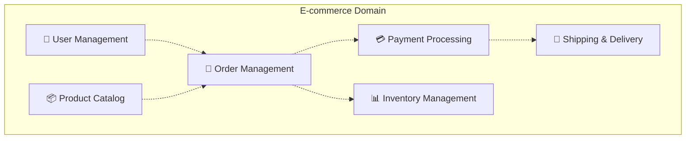

**Преимущества:**
- Команды независимы по бизнес-доменам
- Сервисы эволюционируют с разной скоростью
- Четкие границы ответственности

### 2. Decompose by Subdomain (DDD)

**Проблема:** Сложность определения бизнес-возможностей.

**Решение:** Использование Domain-Driven Design для выделения субдоменов.

```
Core Subdomains:
├── Order Management (главный домен)
├── Payment Processing (критичный)
└── User Authentication (основной)

Supporting Subdomains:
├── Product Catalog
├── Inventory Management
└── Shipping

Generic Subdomains:
├── Notifications
├── Logging
└── Monitoring
```

---

## 🚪 Communication Patterns

### 1. API Gateway Pattern

**Проблема:** Клиенты взаимодействуют с множеством сервисов.

**Решение:** Единая точка входа для всех клиентских запросов.

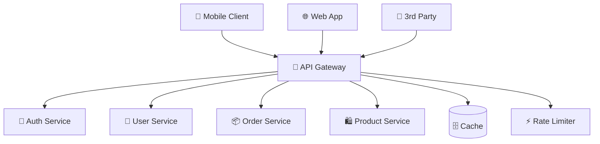

**Responsibilities:**
- Routing и load balancing
- Authentication и authorization
- Rate limiting и throttling
- Request/response transformation
- Monitoring и logging

### 2. Backend for Frontend (BFF)

**Проблема:** Разные клиенты нуждаются в разных данных.

**Решение:** Отдельный backend для каждого типа клиента.

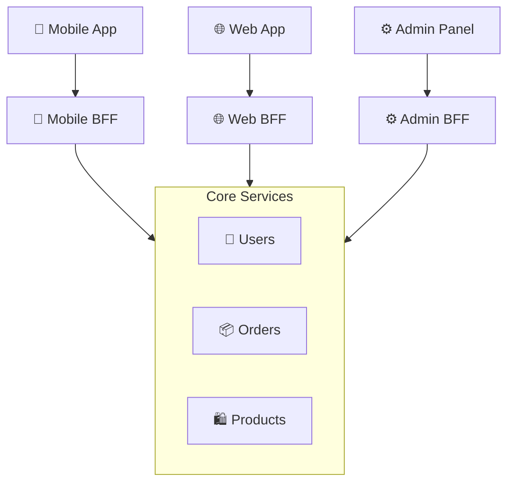

**Преимущества:**
- Оптимизация под каждый клиент
- Независимая эволюция интерфейсов
- Reduced coupling между UI и backend

---

## 📡 Messaging Patterns

### 1. Asynchronous Messaging

**Проблема:** Синхронная коммуникация создает tight coupling.

**Решение:** Асинхронный обмен сообщениями через message broker.

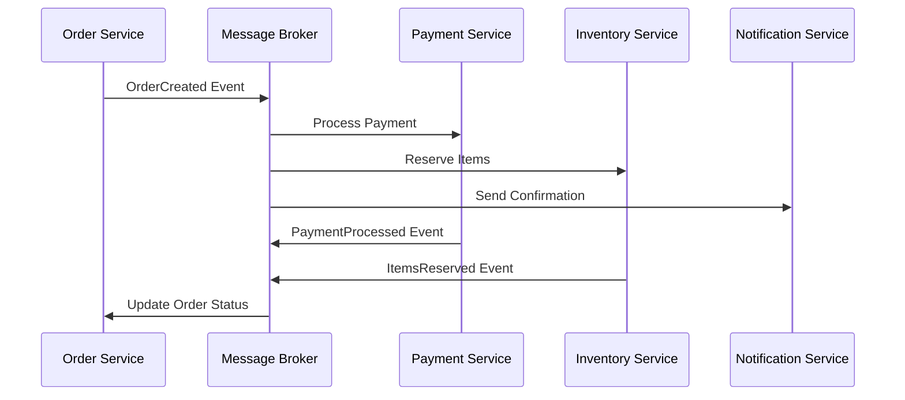

**Message Types:**
- **Commands** - действие, которое должно быть выполнено
- **Events** - уведомление о произошедшем событии
- **Queries** - запрос данных

### 2. Saga Pattern

**Проблема:** Управление транзакциями через несколько сервисов.

**Решение:** Sequence of local transactions с compensation logic.

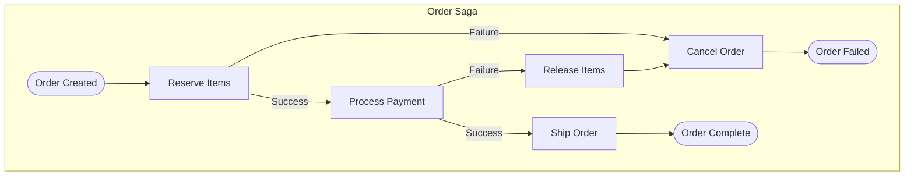

**Types:**
- **Choreography** - каждый сервис знает что делать
- **Orchestration** - центральный координатор управляет процессом

---

## 🔒 Data Management Patterns

### 1. Database per Service

**Проблема:** Shared database создает coupling между сервисами.

**Решение:** Каждый сервис имеет свою приватную базу данных.

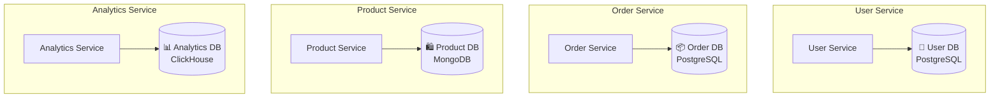

**Benefits:**
- Технологическая гетерогенность
- Независимое масштабирование
- Isolation failures
- Team autonomy

### 2. Event Sourcing

**Проблема:** Потеря истории изменений данных.

**Решение:** Хранение последовательности событий как источника истины.

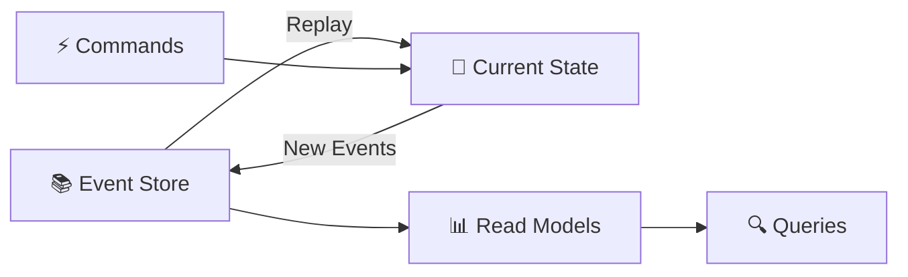

**Advantages:**
- Complete audit trail
- Temporal queries
- Replay events for debugging
- Multiple read models

### 3. CQRS (Command Query Responsibility Segregation)

**Проблема:** Разные требования к чтению и записи данных.

**Решение:** Separate models для команд и запросов.

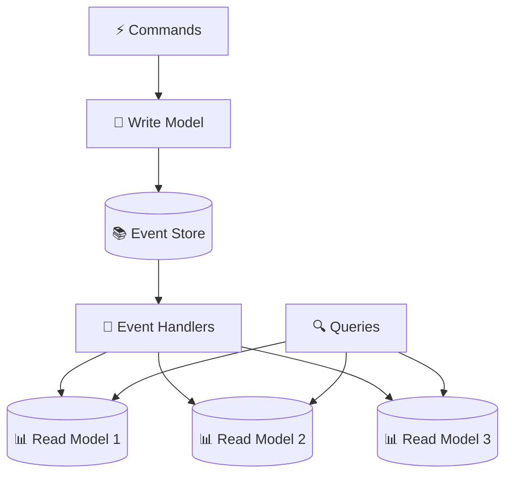

---

## 🛡️ Reliability Patterns

### 1. Circuit Breaker

**Проблема:** Cascade failures в распределенной системе.

**Решение:** Automatic failure detection с fallback механизмом.

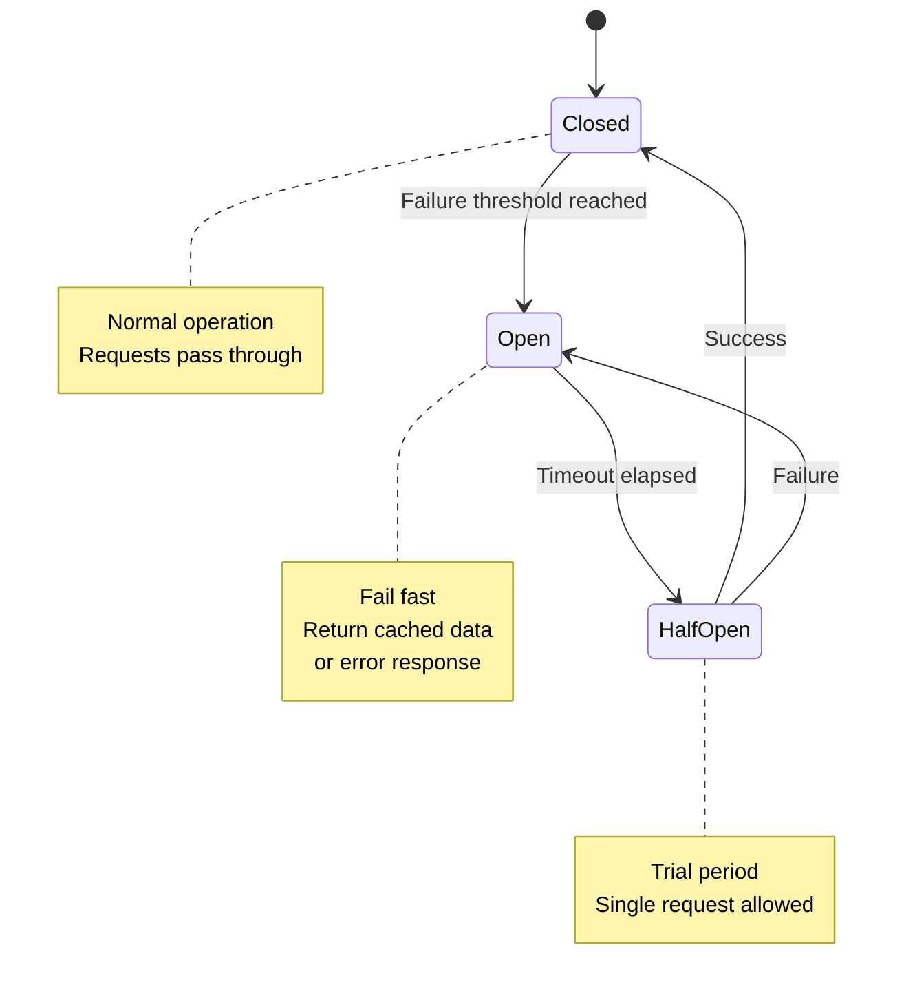

**Implementation:**
```typescript
class CircuitBreaker {
  private state: 'CLOSED' | 'OPEN' | 'HALF_OPEN' = 'CLOSED'
  private failures = 0
  private nextAttempt = 0
  
  async call<T>(fn: () => Promise<T>): Promise<T> {
    if (this.state === 'OPEN' && Date.now() < this.nextAttempt) {
      throw new Error('Circuit breaker is OPEN')
    }
    
    try {
      const result = await fn()
      this.onSuccess()
      return result
    } catch (error) {
      this.onFailure()
      throw error
    }
  }
}
```

### 2. Retry Pattern

**Проблема:** Temporary failures в network calls.

**Решение:** Automatic retry с exponential backoff.

```typescript
async function retryWithBackoff<T>(
  fn: () => Promise<T>,
  maxRetries: number = 3,
  baseDelay: number = 1000
): Promise<T> {
  for (let attempt = 0; attempt <= maxRetries; attempt++) {
    try {
      return await fn()
    } catch (error) {
      if (attempt === maxRetries) throw error
      
      const delay = baseDelay * Math.pow(2, attempt)
      const jitter = Math.random() * 0.1 * delay
      
      await sleep(delay + jitter)
    }
  }
}
```

### 3. Bulkhead Pattern

**Проблема:** Resource exhaustion affects всю систему.

**Решение:** Isolation resources в separate pools.

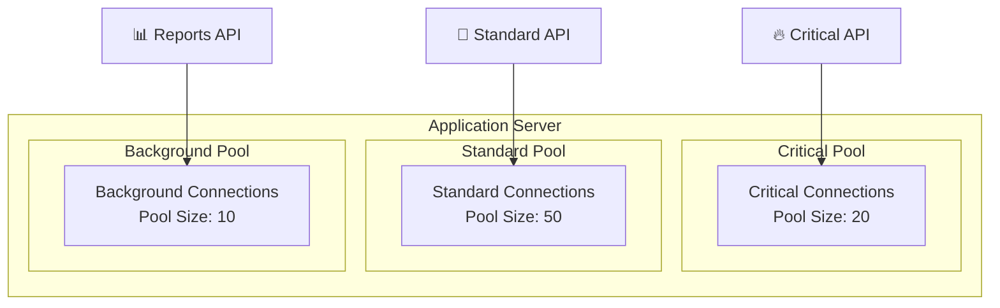

---

## 🔍 Observability Patterns

### 1. Distributed Tracing

**Проблема:** Debugging requests через multiple services.

**Решение:** Trace ID propagation через все сервисы.

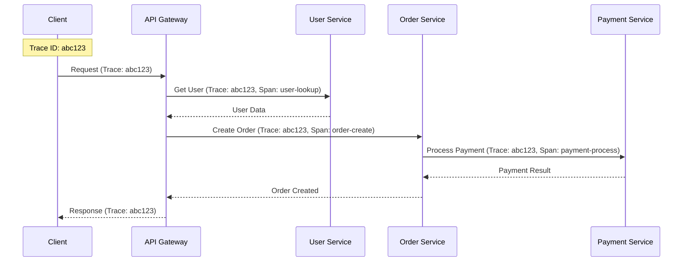

### 2. Health Check API

**Проблема:** Мониторинг состояния сервисов.

**Решение:** Standardized health check endpoints.

```json
// GET /health
{
  "status": "healthy",
  "version": "1.2.3",
  "checks": {
    "database": {
      "status": "healthy",
      "responseTime": "2ms"
    },
    "redis": {
      "status": "healthy", 
      "responseTime": "1ms"
    },
    "external_api": {
      "status": "degraded",
      "responseTime": "500ms",
      "message": "Slow response times"
    }
  },
  "dependencies": [
    {
      "name": "user-service",
      "status": "healthy",
      "url": "http://user-service:8080/health"
    }
  ]
}
```

### 3. Centralized Logging

**Проблема:** Logs scattered across множество сервисов.

**Решение:** Structured logging в centralized log aggregation.

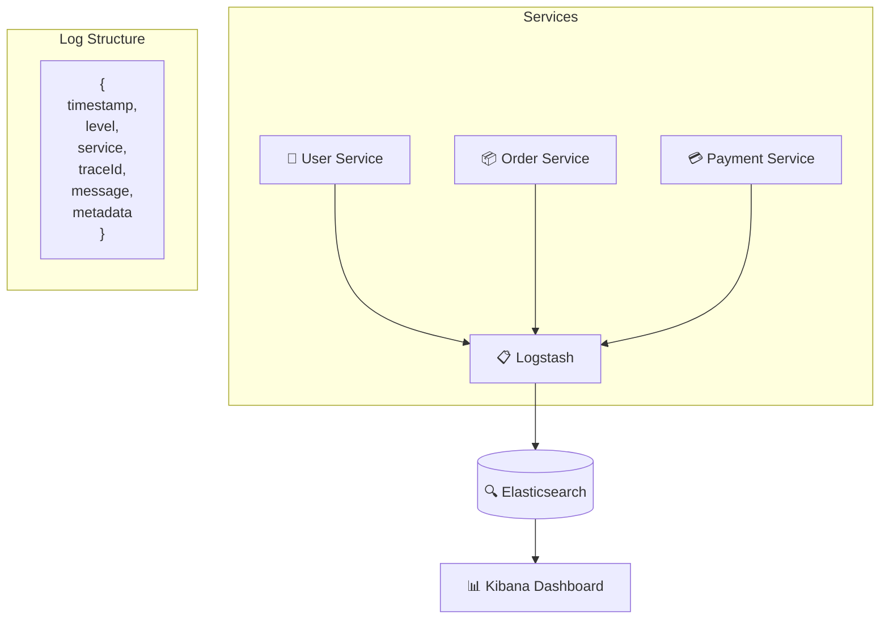

---

## 🔧 Testing Patterns

### 1. Consumer-Driven Contract Testing

**Проблема:** Breaking changes между producer и consumer.

**Решение:** Contracts defined by consumers, verified by producers.

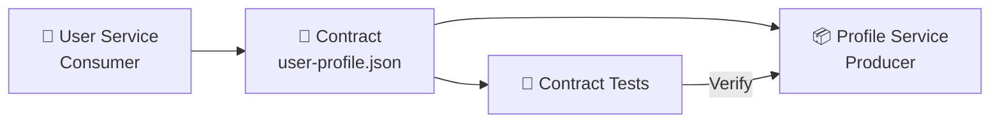

### 2. Test Pyramid для Microservices

```mermaid
pyramid
    title Microservice Test Pyramid
    
    "E2E Tests" : 5
    "Contract Tests" : 15
    "Integration Tests" : 25
    "Unit Tests" : 55
```

**Levels:**
- **Unit Tests** - business logic, domain models
- **Integration Tests** - database, external APIs
- **Contract Tests** - service interfaces
- **E2E Tests** - complete user journeys

---

## 🚀 Deployment Patterns

### 1. Blue-Green Deployment

**Проблема:** Zero-downtime deployments.

**Решение:** Two identical production environments.

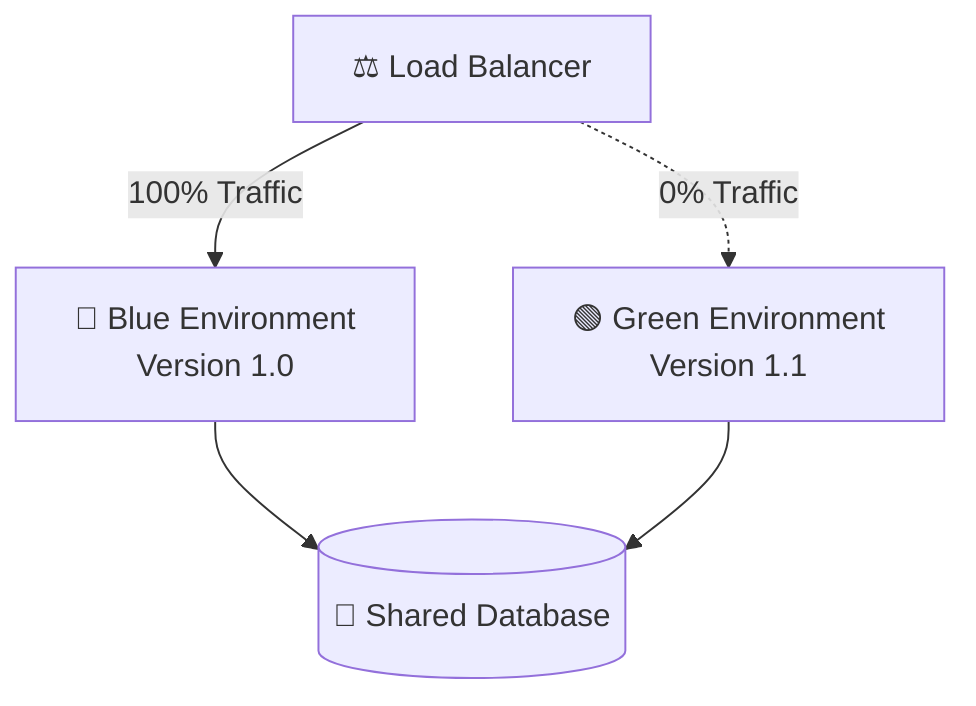

**Process:**
1. Deploy new version to Green
2. Test Green environment
3. Switch traffic to Green
4. Blue становится staging для следующего release

### 2. Canary Deployment

**Проблема:** Risk mitigation при новых releases.

**Решение:** Gradual rollout к subset пользователей.

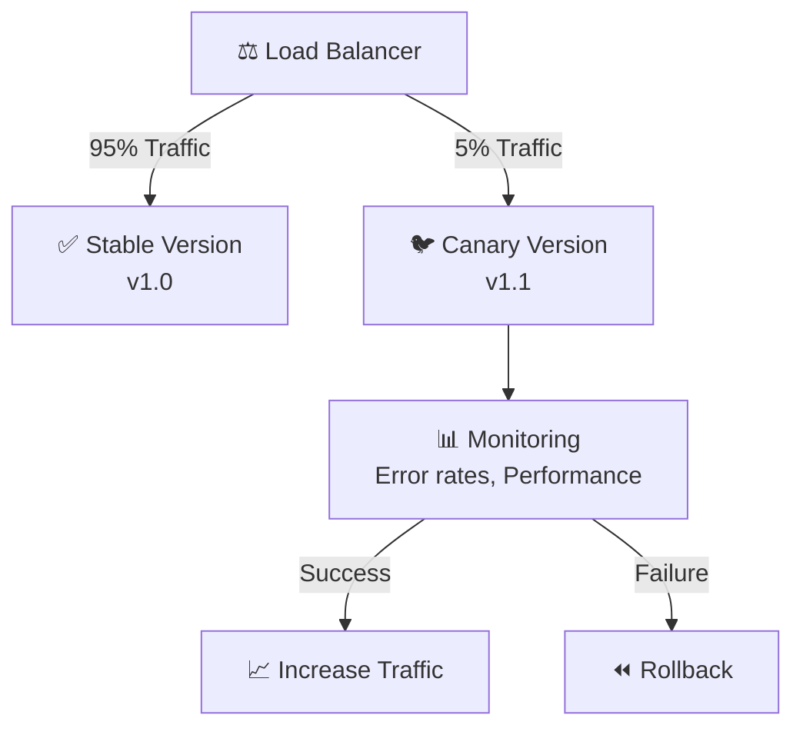

---

## 📚 Связанные темы

- [[../fundamentals/ddd-patterns|DDD Patterns]]
- [[../fundamentals/cqrs-pattern|CQRS Pattern]]
- [[../fundamentals/event-sourcing|Event Sourcing]]
- [[../architecture/microservices-architecture|Microservices Architecture]]
- [[../technical-skills/testing|Testing Strategies]]
- [[user-service|User Service]] - DDD + CQRS example
- [[order-service|Order Service]] - Event Sourcing example
- [[api-gateway|API Gateway]] - Gateway pattern example

---

## 🎯 Best Practices

### Design Principles
- **Single Responsibility** - один сервис, одна задача
- **Loose Coupling** - минимальные зависимости
- **High Cohesion** - связанная функциональность вместе
- **Autonomous Teams** - team ownership сервисов

### Communication Guidelines
- **Async by default** - prefer events over direct calls
- **Idempotent operations** - safe retry mechanisms
- **Backward compatibility** - версионирование APIs
- **Circuit breakers** - fail fast, graceful degradation

### Data Management
- **Database per service** - data isolation
- **Eventual consistency** - accept временную inconsistency
- **Saga patterns** - distributed transaction management
- **Event sourcing** - audit trail и temporal queries 