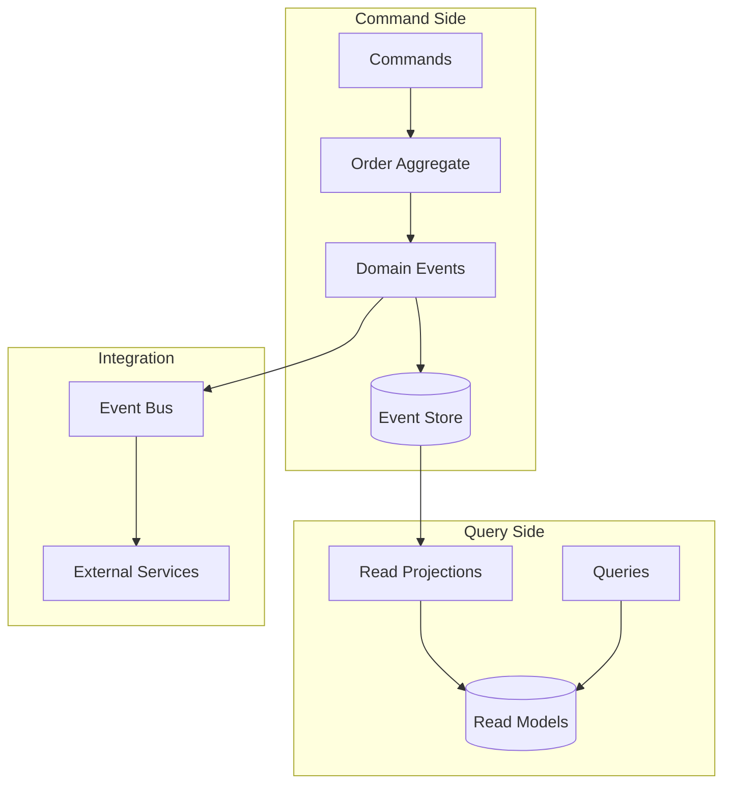

# 📦 Order Service - Python + Event Sourcing

## 📝 Описание

Микросервис управления заказами с архитектурным паттерном **Event Sourcing**, демонстрирующий:
- **Event Sourcing** как источник истины
- **CQRS** для разделения команд и запросов
- **Domain Events** для интеграции
- **Saga Pattern** для распределенных транзакций

---

## 🏗️ Архитектура Event Sourcing



### Структура проекта

```
order-service/
├── domain/
│   ├── order.py              # 📋 Order Aggregate
│   ├── events.py             # 🎯 Domain Events
│   └── value_objects.py      # 💎 Value Objects
├── infrastructure/
│   ├── event_store.py        # 📚 Event Store Implementation
│   ├── projections.py        # 📊 Read Model Projections
│   └── event_bus.py         # 📡 Event Bus
├── application/
│   ├── commands.py          # ⚡ Command Handlers
│   ├── queries.py           # 🔍 Query Handlers
│   └── sagas.py            # 🔄 Saga Coordinators
└── api/
    ├── rest_api.py          # 🌐 REST API Endpoints
    └── dto.py               # 📦 Data Transfer Objects
```

---

## 🎯 Event Sourcing Implementation

### Order Aggregate

```python
@dataclass
class Order:
    """Агрегат заказа с Event Sourcing"""
    id: OrderID
    user_id: UserID
    status: OrderStatus
    items: Dict[ProductID, OrderItem]
    total_amount: Decimal
    created_at: Optional[datetime] = None
    version: int = 0
    _uncommitted_events: List[DomainEvent] = field(default_factory=list)
    
    @classmethod
    def create(cls, user_id: UserID) -> 'Order':
        """Создание нового заказа"""
        order_id = OrderID.generate()
        order = cls(
            id=order_id,
            user_id=user_id,
            status=OrderStatus.DRAFT,
            items={},
            total_amount=Decimal('0'),
            created_at=datetime.utcnow()
        )
        
        # Создание доменного события
        event = OrderCreatedEvent(
            order_id=order_id,
            user_id=user_id,
            created_at=order.created_at
        )
        order._apply_event(event)
        return order
    
    def add_item(self, product_id: ProductID, quantity: int, price: Decimal):
        """Добавление товара в заказ"""
        if self.status != OrderStatus.DRAFT:
            raise OrderNotDraftError(f"Cannot add items to {self.status} order")
            
        item = OrderItem(product_id, quantity, price)
        
        event = ItemAddedToOrderEvent(
            order_id=self.id,
            product_id=product_id,
            quantity=quantity,
            price=price,
            total_price=item.total_price
        )
        self._apply_event(event)
    
    def confirm(self):
        """Подтверждение заказа"""
        if self.status != OrderStatus.DRAFT:
            raise InvalidOrderStatusError(f"Cannot confirm {self.status} order")
            
        if not self.items:
            raise EmptyOrderError("Cannot confirm empty order")
            
        event = OrderConfirmedEvent(
            order_id=self.id,
            total_amount=self.total_amount,
            confirmed_at=datetime.utcnow()
        )
        self._apply_event(event)
    
    @classmethod
    def from_events(cls, events: List[DomainEvent]) -> 'Order':
        """Восстановление агрегата из событий"""
        if not events:
            raise ValueError("Cannot restore order from empty events")
            
        order = cls.__new__(cls)
        order._uncommitted_events = []
        
        for event in events:
            order._apply_event(event, is_replay=True)
            
        return order
```

### Domain Events

```python
class OrderCreatedEvent(DomainEvent):
    order_id: OrderID
    user_id: UserID
    created_at: datetime
    
    def event_type(self) -> str:
        return "order.created"

class ItemAddedToOrderEvent(DomainEvent):
    order_id: OrderID
    product_id: ProductID
    quantity: int
    price: Decimal
    total_price: Decimal
    
    def event_type(self) -> str:
        return "order.item_added"

class OrderConfirmedEvent(DomainEvent):
    order_id: OrderID
    total_amount: Decimal
    confirmed_at: datetime
    
    def event_type(self) -> str:
        return "order.confirmed"

class OrderShippedEvent(DomainEvent):
    order_id: OrderID
    tracking_number: str
    shipped_at: datetime
    
    def event_type(self) -> str:
        return "order.shipped"
```

---

## 📚 Event Store

### PostgreSQL Event Store

```python
class PostgreSQLEventStore:
    """Event Store реализация с PostgreSQL"""
    
    def __init__(self, connection_string: str):
        self.engine = create_async_engine(connection_string)
    
    async def save_events(
        self, 
        aggregate_id: UUID, 
        events: List[DomainEvent], 
        expected_version: int
    ):
        """Сохранение событий с проверкой версии"""
        async with self.engine.begin() as conn:
            # Проверка версии для Optimistic Concurrency Control
            current_version = await self._get_current_version(conn, aggregate_id)
            
            if current_version != expected_version:
                raise ConcurrencyError(
                    f"Expected version {expected_version}, but current is {current_version}"
                )
            
            # Сохранение событий
            for i, event in enumerate(events):
                event_data = EventData(
                    event_id=uuid4(),
                    aggregate_id=aggregate_id,
                    event_type=event.event_type(),
                    event_data=event.to_json(),
                    version=expected_version + i + 1,
                    timestamp=datetime.utcnow()
                )
                
                await conn.execute(
                    insert(events_table).values(event_data.to_dict())
                )
    
    async def get_events(
        self, 
        aggregate_id: UUID, 
        from_version: int = 0
    ) -> List[DomainEvent]:
        """Получение событий для агрегата"""
        async with self.engine.connect() as conn:
            result = await conn.execute(
                select(events_table)
                .where(events_table.c.aggregate_id == aggregate_id)
                .where(events_table.c.version > from_version)
                .order_by(events_table.c.version)
            )
            
            events = []
            for row in result:
                event = self._deserialize_event(row.event_type, row.event_data)
                events.append(event)
                
            return events
```

### Event Projections

```python
class OrderProjection:
    """Проекция для быстрого чтения заказов"""
    
    def __init__(self, db_connection):
        self.db = db_connection
    
    async def handle_order_created(self, event: OrderCreatedEvent):
        """Обработка события создания заказа"""
        await self.db.execute(
            insert(order_read_model).values(
                id=event.order_id,
                user_id=event.user_id,
                status='draft',
                total_amount=0,
                items_count=0,
                created_at=event.created_at
            )
        )
    
    async def handle_item_added(self, event: ItemAddedToOrderEvent):
        """Обработка добавления товара"""
        await self.db.execute(
            update(order_read_model)
            .where(order_read_model.c.id == event.order_id)
            .values(
                total_amount=order_read_model.c.total_amount + event.total_price,
                items_count=order_read_model.c.items_count + 1
            )
        )
    
    async def handle_order_confirmed(self, event: OrderConfirmedEvent):
        """Обработка подтверждения заказа"""
        await self.db.execute(
            update(order_read_model)
            .where(order_read_model.c.id == event.order_id)
            .values(
                status='confirmed',
                confirmed_at=event.confirmed_at
            )
        )
```

---

## ⚡ CQRS Handlers

### Command Handlers

```python
class CreateOrderCommandHandler:
    def __init__(self, event_store: EventStore, event_bus: EventBus):
        self.event_store = event_store
        self.event_bus = event_bus
    
    async def handle(self, command: CreateOrderCommand) -> OrderID:
        # Создание агрегата
        order = Order.create(command.user_id)
        
        # Сохранение событий
        await self.event_store.save_events(
            order.id, 
            order.get_uncommitted_events(), 
            0
        )
        
        # Публикация событий
        for event in order.get_uncommitted_events():
            await self.event_bus.publish(event)
        
        order.mark_events_as_committed()
        return order.id

class AddItemCommandHandler:
    def __init__(self, event_store: EventStore, event_bus: EventBus):
        self.event_store = event_store
        self.event_bus = event_bus
    
    async def handle(self, command: AddItemCommand):
        # Загрузка агрегата из событий
        events = await self.event_store.get_events(command.order_id)
        order = Order.from_events(events)
        
        # Выполнение команды
        order.add_item(
            command.product_id, 
            command.quantity, 
            command.price
        )
        
        # Сохранение новых событий
        await self.event_store.save_events(
            order.id,
            order.get_uncommitted_events(),
            order.version - len(order.get_uncommitted_events())
        )
        
        # Публикация событий
        for event in order.get_uncommitted_events():
            await self.event_bus.publish(event)
```

### Query Handlers

```python
class GetOrderQueryHandler:
    def __init__(self, read_db: Database):
        self.read_db = read_db
    
    async def handle(self, query: GetOrderQuery) -> OrderReadModel:
        result = await self.read_db.fetch_one(
            select(order_read_model)
            .where(order_read_model.c.id == query.order_id)
        )
        
        if not result:
            raise OrderNotFoundError(f"Order {query.order_id} not found")
        
        return OrderReadModel.from_db_row(result)

class GetUserOrdersQueryHandler:
    def __init__(self, read_db: Database):
        self.read_db = read_db
    
    async def handle(self, query: GetUserOrdersQuery) -> List[OrderReadModel]:
        results = await self.read_db.fetch_all(
            select(order_read_model)
            .where(order_read_model.c.user_id == query.user_id)
            .order_by(order_read_model.c.created_at.desc())
            .limit(query.limit)
            .offset(query.offset)
        )
        
        return [OrderReadModel.from_db_row(row) for row in results]
```

---

## 🔄 Saga Pattern

### Order Processing Saga

```python
class OrderProcessingSaga:
    """Сага для обработки заказа через несколько сервисов"""
    
    def __init__(self, event_bus: EventBus, command_bus: CommandBus):
        self.event_bus = event_bus
        self.command_bus = command_bus
    
    async def handle_order_confirmed(self, event: OrderConfirmedEvent):
        """Начало саги при подтверждении заказа"""
        try:
            # 1. Резервирование товаров
            await self.command_bus.send(
                ReserveItemsCommand(
                    order_id=event.order_id,
                    items=event.items
                )
            )
        except Exception as e:
            # Компенсирующая транзакция
            await self.command_bus.send(
                CancelOrderCommand(
                    order_id=event.order_id,
                    reason="Failed to reserve items"
                )
            )
    
    async def handle_items_reserved(self, event: ItemsReservedEvent):
        """Продолжение саги после резервирования"""
        try:
            # 2. Обработка платежа
            await self.command_bus.send(
                ProcessPaymentCommand(
                    order_id=event.order_id,
                    amount=event.total_amount
                )
            )
        except Exception as e:
            # Компенсация: отмена резервирования
            await self.command_bus.send(
                CancelReservationCommand(order_id=event.order_id)
            )
            await self.command_bus.send(
                CancelOrderCommand(
                    order_id=event.order_id,
                    reason="Payment processing failed"
                )
            )
    
    async def handle_payment_processed(self, event: PaymentProcessedEvent):
        """Завершение саги при успешном платеже"""
        # 3. Отправка заказа
        await self.command_bus.send(
            ShipOrderCommand(order_id=event.order_id)
        )
```

---

## 🌐 FastAPI Integration

### REST API Endpoints

```python
@app.post("/orders", response_model=OrderResponse)
async def create_order(
    request: CreateOrderRequest,
    command_handler: CreateOrderCommandHandler = Depends()
):
    """Создание нового заказа"""
    command = CreateOrderCommand(user_id=request.user_id)
    order_id = await command_handler.handle(command)
    
    # Возврат созданного заказа
    query = GetOrderQuery(order_id=order_id)
    query_handler = GetOrderQueryHandler(read_db)
    order = await query_handler.handle(query)
    
    return OrderResponse.from_read_model(order)

@app.post("/orders/{order_id}/items")
async def add_item_to_order(
    order_id: UUID,
    request: AddItemRequest,
    command_handler: AddItemCommandHandler = Depends()
):
    """Добавление товара в заказ"""
    command = AddItemCommand(
        order_id=order_id,
        product_id=request.product_id,
        quantity=request.quantity,
        price=request.price
    )
    
    await command_handler.handle(command)
    return {"message": "Item added successfully"}

@app.get("/orders/{order_id}", response_model=OrderResponse)
async def get_order(
    order_id: UUID,
    query_handler: GetOrderQueryHandler = Depends()
):
    """Получение заказа по ID"""
    query = GetOrderQuery(order_id=order_id)
    order = await query_handler.handle(query)
    return OrderResponse.from_read_model(order)
```

---

## 🔧 Технологии

### Core Stack
- **Python 3.11+** - Современный Python с type hints
- **FastAPI** - Асинхронный веб-фреймворк
- **SQLAlchemy 2.0** - Async ORM для PostgreSQL
- **Pydantic** - Валидация данных и serialization
- **PostgreSQL** - Event Store и Read Models

### Event Sourcing Tools
- **asyncpg** - Асинхронный PostgreSQL драйвер
- **Redis** - Event Bus для pub/sub
- **Celery** - Асинхронная обработка событий
- **RabbitMQ** - Message broker для saga

---

## 🧪 Testing

### Unit Tests
```python
async def test_create_order():
    # Arrange
    user_id = UserID.generate()
    
    # Act
    order = Order.create(user_id)
    
    # Assert
    assert order.user_id == user_id
    assert order.status == OrderStatus.DRAFT
    assert len(order.get_uncommitted_events()) == 1
    assert isinstance(order.get_uncommitted_events()[0], OrderCreatedEvent)

async def test_add_item_to_order():
    # Arrange
    order = Order.create(UserID.generate())
    product_id = ProductID.generate()
    
    # Act
    order.add_item(product_id, 2, Decimal('10.00'))
    
    # Assert
    assert product_id in order.items
    assert order.items[product_id].quantity == 2
    assert order.total_amount == Decimal('20.00')
```

### Integration Tests
```python
async def test_event_store_roundtrip():
    # Создание и сохранение событий
    order = Order.create(UserID.generate())
    order.add_item(ProductID.generate(), 1, Decimal('5.00'))
    
    await event_store.save_events(
        order.id, 
        order.get_uncommitted_events(), 
        0
    )
    
    # Восстановление из событий
    events = await event_store.get_events(order.id)
    restored_order = Order.from_events(events)
    
    assert restored_order.id == order.id
    assert restored_order.total_amount == order.total_amount
```

---

## 🔗 Связанные темы

- [[../fundamentals/event-sourcing|Event Sourcing]]
- [[../fundamentals/cqrs-pattern|CQRS Pattern]]
- [[../fundamentals/ddd-patterns|DDD Patterns]]
- [[user-service|User Service]] - интеграция через события
- [[api-gateway|API Gateway]] - точка входа
- [[../technical-skills/databases/postgresql|PostgreSQL]]

---

## 🎯 Ключевые преимущества

### Event Sourcing Benefits
- **Полная история** изменений агрегатов
- **Восстановление состояния** в любой момент времени
- **Audit trail** из коробки
- **Temporal queries** для аналитики
- **Eventual consistency** между сервисами

### Performance Characteristics  
- **Высокая производительность записи** (append-only)
- **Независимое масштабирование** чтения и записи
- **Оптимизированные** read models для запросов
- **Асинхронная** обработка событий 