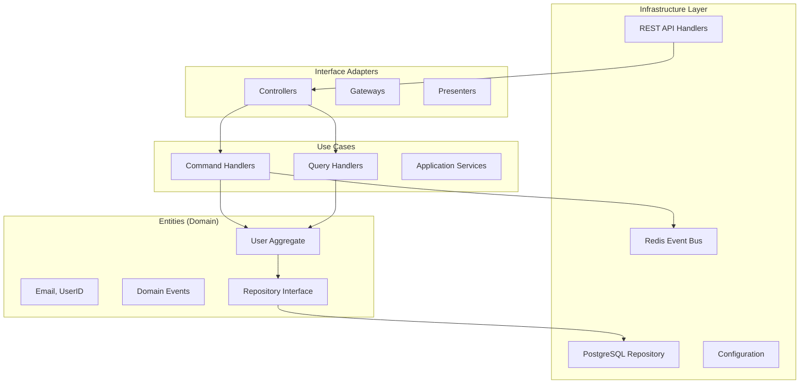

# 👤 User Service - Go + DDD + CQRS

## 📝 Описание

Микросервис управления пользователями, демонстрирующий современные архитектурные подходы:
- **Domain-Driven Design (DDD)** для моделирования бизнес-логики
- **Command Query Responsibility Segregation (CQRS)** для разделения операций
- **Clean Architecture** для поддерживаемости кода
- **GoF Design Patterns** для качественной архитектуры

---

## 🏗️ Архитектура

### Clean Architecture слои



### Структура проекта

```
user-service/
├── cmd/
│   └── main.go                # 🚀 Точка входа
├── internal/
│   ├── domain/                # 🏛️ Доменный слой
│   │   ├── user.go           # User Aggregate Root
│   │   ├── events.go         # Domain Events
│   │   └── repository.go     # Repository Interface
│   ├── application/          # 📋 Слой приложения
│   │   ├── commands.go       # Command Handlers (CQRS)
│   │   ├── queries.go        # Query Handlers (CQRS)
│   │   └── dto.go            # Data Transfer Objects
│   ├── infrastructure/       # 🔧 Инфраструктурный слой
│   │   ├── repository.go     # PostgreSQL Repository
│   │   ├── database.go       # Database Connection
│   │   └── config.go         # Configuration
│   └── api/                  # 🌐 API слой
│       ├── rest_handler.go   # HTTP Handlers
│       ├── middleware.go     # Middleware
│       └── routes.go         # Route Definitions
```

---

## 🎯 Domain-Driven Design

### Агрегат User

```go
// User - корень агрегата для управления пользователями
type User struct {
    ID        UserID    `json:"id"`
    Email     Email     `json:"email"`
    Name      string    `json:"name"`
    Status    UserStatus `json:"status"`
    CreatedAt time.Time `json:"created_at"`
    UpdatedAt time.Time `json:"updated_at"`
    Version   int       `json:"version"` // для Optimistic Locking
}

// Бизнес-методы агрегата
func (u *User) Block() error {
    if u.Status == UserStatusBlocked {
        return ErrUserAlreadyBlocked
    }
    u.Status = UserStatusBlocked
    u.UpdatedAt = time.Now()
    return nil
}

func (u *User) Unblock() error {
    if u.Status != UserStatusBlocked {
        return ErrUserNotBlocked
    }
    u.Status = UserStatusActive
    u.UpdatedAt = time.Now()
    return nil
}

func (u *User) ChangeEmail(newEmail Email) error {
    if u.Email.Equals(newEmail) {
        return ErrEmailUnchanged
    }
    u.Email = newEmail
    u.UpdatedAt = time.Now()
    return nil
}
```

### Value Objects

```go
// Email - Value Object для email адреса
type Email struct {
    value string
}

func NewEmail(email string) (Email, error) {
    if !isValidEmail(email) {
        return Email{}, ErrInvalidEmail
    }
    return Email{value: strings.ToLower(email)}, nil
}

func (e Email) String() string {
    return e.value
}

func (e Email) Equals(other Email) bool {
    return e.value == other.value
}

// UserID - Value Object для идентификатора пользователя
type UserID struct {
    value uuid.UUID
}

func NewUserID() UserID {
    return UserID{value: uuid.New()}
}

func ParseUserID(s string) (UserID, error) {
    id, err := uuid.Parse(s)
    if err != nil {
        return UserID{}, ErrInvalidUserID
    }
    return UserID{value: id}, nil
}
```

### Domain Events

```go
// UserCreatedEvent - событие создания пользователя
type UserCreatedEvent struct {
    UserID    UserID    `json:"user_id"`
    Email     Email     `json:"email"`
    Name      string    `json:"name"`
    CreatedAt time.Time `json:"created_at"`
}

func (e UserCreatedEvent) EventType() string {
    return "user.created"
}

// UserBlockedEvent - событие блокировки пользователя
type UserBlockedEvent struct {
    UserID    UserID    `json:"user_id"`
    Reason    string    `json:"reason"`
    BlockedAt time.Time `json:"blocked_at"`
}

func (e UserBlockedEvent) EventType() string {
    return "user.blocked"
}
```

---

## ⚡ CQRS Implementation

### Command Side

```go
// CreateUserCommand - команда создания пользователя
type CreateUserCommand struct {
    Email    string `json:"email" binding:"required,email"`
    Name     string `json:"name" binding:"required,min=2,max=100"`
    Password string `json:"password" binding:"required,min=8"`
}

// CreateUserCommandHandler - обработчик команды создания
type CreateUserCommandHandler struct {
    userRepo   domain.UserRepository
    eventBus   EventBus
    logger     *zap.Logger
}

func (h *CreateUserCommandHandler) Handle(ctx context.Context, cmd CreateUserCommand) (*UserResponse, error) {
    // 1. Валидация и создание Value Objects
    email, err := domain.NewEmail(cmd.Email)
    if err != nil {
        return nil, err
    }
    
    // 2. Проверка бизнес-правил
    existing, err := h.userRepo.GetByEmail(ctx, email)
    if err != nil && !errors.Is(err, domain.ErrUserNotFound) {
        return nil, err
    }
    if existing != nil {
        return nil, domain.ErrUserAlreadyExists
    }
    
    // 3. Создание агрегата
    hashedPassword, err := bcrypt.GenerateFromPassword([]byte(cmd.Password), bcrypt.DefaultCost)
    if err != nil {
        return nil, err
    }
    
    user := domain.NewUser(email, cmd.Name, string(hashedPassword))
    
    // 4. Сохранение в репозиторий
    err = h.userRepo.Save(ctx, user)
    if err != nil {
        return nil, err
    }
    
    // 5. Публикация доменного события
    event := domain.UserCreatedEvent{
        UserID:    user.ID,
        Email:     user.Email,
        Name:      user.Name,
        CreatedAt: user.CreatedAt,
    }
    
    err = h.eventBus.Publish(ctx, event)
    if err != nil {
        h.logger.Error("failed to publish event", zap.Error(err))
    }
    
    return convertToUserResponse(user), nil
}
```

### Query Side

```go
// GetUserQuery - запрос пользователя по ID
type GetUserQuery struct {
    UserID string `uri:"id" binding:"required,uuid"`
}

// GetUserQueryHandler - обработчик запроса пользователя
type GetUserQueryHandler struct {
    userRepo domain.UserRepository
    cache    Cache
    logger   *zap.Logger
}

func (h *GetUserQueryHandler) Handle(ctx context.Context, query GetUserQuery) (*UserResponse, error) {
    userID, err := domain.ParseUserID(query.UserID)
    if err != nil {
        return nil, err
    }
    
    // Попытка получить из кеша
    cacheKey := fmt.Sprintf("user:%s", userID.String())
    if cached, err := h.cache.Get(ctx, cacheKey); err == nil {
        var user UserResponse
        if err := json.Unmarshal(cached, &user); err == nil {
            return &user, nil
        }
    }
    
    // Получение из репозитория
    user, err := h.userRepo.GetByID(ctx, userID)
    if err != nil {
        return nil, err
    }
    
    response := convertToUserResponse(user)
    
    // Кеширование результата
    if data, err := json.Marshal(response); err == nil {
        h.cache.Set(ctx, cacheKey, data, time.Hour)
    }
    
    return response, nil
}
```

---

## 🔧 Infrastructure Layer

### Repository Implementation

```go
// PostgresUserRepository - реализация репозитория для PostgreSQL
type PostgresUserRepository struct {
    db *gorm.DB
}

func NewPostgresUserRepository(db *gorm.DB) *PostgresUserRepository {
    return &PostgresUserRepository{db: db}
}

func (r *PostgresUserRepository) Save(ctx context.Context, user *domain.User) error {
    userModel := convertToUserModel(user)
    
    // Optimistic locking
    result := r.db.WithContext(ctx).
        Where("id = ? AND version = ?", user.ID.String(), user.Version-1).
        Save(userModel)
    
    if result.Error != nil {
        return result.Error
    }
    
    if result.RowsAffected == 0 {
        return domain.ErrConcurrentUpdate
    }
    
    return nil
}

func (r *PostgresUserRepository) GetByID(ctx context.Context, id domain.UserID) (*domain.User, error) {
    var userModel UserModel
    
    err := r.db.WithContext(ctx).
        Where("id = ?", id.String()).
        First(&userModel).Error
    
    if errors.Is(err, gorm.ErrRecordNotFound) {
        return nil, domain.ErrUserNotFound
    }
    
    if err != nil {
        return nil, err
    }
    
    return convertToDomainUser(&userModel)
}
```

### Event Bus Implementation

```go
// RedisEventBus - реализация Event Bus с Redis Pub/Sub
type RedisEventBus struct {
    client *redis.Client
    logger *zap.Logger
}

func NewRedisEventBus(redisURL string) *RedisEventBus {
    opts, err := redis.ParseURL(redisURL)
    if err != nil {
        log.Fatal("Failed to parse Redis URL:", err)
    }
    
    client := redis.NewClient(opts)
    
    return &RedisEventBus{
        client: client,
        logger: zap.NewExample(),
    }
}

func (e *RedisEventBus) Publish(ctx context.Context, event domain.DomainEvent) error {
    eventData := EventEnvelope{
        EventType: event.EventType(),
        EventID:   uuid.New().String(),
        Timestamp: time.Now(),
        Data:      event,
    }
    
    jsonData, err := json.Marshal(eventData)
    if err != nil {
        return err
    }
    
    return e.client.Publish(ctx, event.EventType(), jsonData).Err()
}
```

---

## 🌐 API Layer

### REST Handlers

```go
// UserHandler - HTTP обработчики для User API
type UserHandler struct {
    commandHandler *application.CommandHandler
    queryHandler   *application.QueryHandler
}

func NewUserHandler(ch *application.CommandHandler, qh *application.QueryHandler) *UserHandler {
    return &UserHandler{
        commandHandler: ch,
        queryHandler:   qh,
    }
}

// CreateUser - POST /users
func (h *UserHandler) CreateUser(c *gin.Context) {
    var cmd application.CreateUserCommand
    
    if err := c.ShouldBindJSON(&cmd); err != nil {
        c.JSON(http.StatusBadRequest, ErrorResponse{
            Error: "Invalid request body",
            Details: err.Error(),
        })
        return
    }
    
    user, err := h.commandHandler.CreateUser(c.Request.Context(), cmd)
    if err != nil {
        handleError(c, err)
        return
    }
    
    c.JSON(http.StatusCreated, user)
}

// GetUser - GET /users/:id
func (h *UserHandler) GetUser(c *gin.Context) {
    var query application.GetUserQuery
    
    if err := c.ShouldBindUri(&query); err != nil {
        c.JSON(http.StatusBadRequest, ErrorResponse{
            Error: "Invalid user ID",
            Details: err.Error(),
        })
        return
    }
    
    user, err := h.queryHandler.GetUser(c.Request.Context(), query)
    if err != nil {
        handleError(c, err)
        return
    }
    
    c.JSON(http.StatusOK, user)
}
```

### Middleware

```go
// AuthMiddleware - middleware для аутентификации JWT
func AuthMiddleware() gin.HandlerFunc {
    return func(c *gin.Context) {
        tokenString := extractTokenFromHeader(c.GetHeader("Authorization"))
        if tokenString == "" {
            c.JSON(http.StatusUnauthorized, ErrorResponse{
                Error: "Missing authorization token",
            })
            c.Abort()
            return
        }
        
        claims, err := validateJWTToken(tokenString)
        if err != nil {
            c.JSON(http.StatusUnauthorized, ErrorResponse{
                Error: "Invalid token",
                Details: err.Error(),
            })
            c.Abort()
            return
        }
        
        c.Set("user_id", claims.UserID)
        c.Set("user_roles", claims.Roles)
        c.Next()
    }
}

// CORSMiddleware - middleware для CORS
func CORSMiddleware() gin.HandlerFunc {
    return func(c *gin.Context) {
        c.Writer.Header().Set("Access-Control-Allow-Origin", "*")
        c.Writer.Header().Set("Access-Control-Allow-Credentials", "true")
        c.Writer.Header().Set("Access-Control-Allow-Headers", "Content-Type, Authorization")
        c.Writer.Header().Set("Access-Control-Allow-Methods", "GET, POST, PUT, DELETE, OPTIONS")
        
        if c.Request.Method == "OPTIONS" {
            c.AbortWithStatus(204)
            return
        }
        
        c.Next()
    }
}
```

---

## 🔧 Технологии и инструменты

### Core Technologies
- **Go 1.21+** - Современный Go с generics
- **Gin** - HTTP web framework с высокой производительностью
- **GORM** - ORM для работы с PostgreSQL
- **Redis** - Event Bus и кеширование
- **JWT** - Stateless аутентификация

### Design Patterns
- **Domain-Driven Design** - Моделирование бизнес-логики
- **CQRS** - Разделение команд и запросов
- **Repository Pattern** - Абстракция доступа к данным
- **Factory Pattern** - Создание объектов
- **Observer Pattern** - Доменные события

### Tools & Libraries
- **Zap** - Structured logging
- **Testify** - Unit testing framework
- **Swagger** - API документация
- **Docker** - Контейнеризация
- **Prometheus** - Метрики и мониторинг

---

## 🧪 Тестирование

### Unit Tests

```go
// TestCreateUser - тест создания пользователя
func TestCreateUser(t *testing.T) {
    // Arrange
    mockRepo := &MockUserRepository{}
    mockEventBus := &MockEventBus{}
    handler := NewCreateUserCommandHandler(mockRepo, mockEventBus)
    
    cmd := CreateUserCommand{
        Email:    "test@example.com",
        Name:     "Test User",
        Password: "password123",
    }
    
    mockRepo.On("GetByEmail", mock.Anything, mock.Anything).Return(nil, domain.ErrUserNotFound)
    mockRepo.On("Save", mock.Anything, mock.Anything).Return(nil)
    mockEventBus.On("Publish", mock.Anything, mock.Anything).Return(nil)
    
    // Act
    user, err := handler.Handle(context.Background(), cmd)
    
    // Assert
    assert.NoError(t, err)
    assert.NotNil(t, user)
    assert.Equal(t, cmd.Email, user.Email)
    assert.Equal(t, cmd.Name, user.Name)
    
    mockRepo.AssertExpectations(t)
    mockEventBus.AssertExpectations(t)
}
```

### Integration Tests

```go
// TestUserRepository_Integration - интеграционный тест репозитория
func TestUserRepository_Integration(t *testing.T) {
    // Настройка тестовой БД
    db := setupTestDatabase(t)
    defer cleanupTestDatabase(t, db)
    
    repo := NewPostgresUserRepository(db)
    
    // Создание тестового пользователя
    email, _ := domain.NewEmail("test@example.com")
    user := domain.NewUser(email, "Test User", "hashedpassword")
    
    // Сохранение
    err := repo.Save(context.Background(), user)
    assert.NoError(t, err)
    
    // Получение
    retrieved, err := repo.GetByID(context.Background(), user.ID)
    assert.NoError(t, err)
    assert.Equal(t, user.Email, retrieved.Email)
    assert.Equal(t, user.Name, retrieved.Name)
}
```

---

## 📊 Мониторинг и наблюдаемость

### Метрики (Prometheus)

```go
var (
    userCreations = prometheus.NewCounterVec(
        prometheus.CounterOpts{
            Name: "user_creations_total",
            Help: "Total number of user creations",
        },
        []string{"status"},
    )
    
    userQueries = prometheus.NewHistogramVec(
        prometheus.HistogramOpts{
            Name: "user_query_duration_seconds",
            Help: "Duration of user queries",
        },
        []string{"operation"},
    )
)

// InstrumentationMiddleware - middleware для метрик
func InstrumentationMiddleware() gin.HandlerFunc {
    return func(c *gin.Context) {
        start := time.Now()
        
        c.Next()
        
        duration := time.Since(start)
        
        userQueries.WithLabelValues(c.Request.URL.Path).Observe(duration.Seconds())
        
        if c.Writer.Status() >= 200 && c.Writer.Status() < 300 {
            userCreations.WithLabelValues("success").Inc()
        } else {
            userCreations.WithLabelValues("error").Inc()
        }
    }
}
```

### Structured Logging

```go
// Logger configuration
func NewLogger() *zap.Logger {
    config := zap.NewProductionConfig()
    config.OutputPaths = []string{"stdout"}
    config.EncoderConfig.TimeKey = "timestamp"
    config.EncoderConfig.EncodeTime = zapcore.ISO8601TimeEncoder
    
    logger, _ := config.Build()
    return logger
}

// Usage in handlers
func (h *UserHandler) CreateUser(c *gin.Context) {
    logger := h.logger.With(
        zap.String("request_id", c.GetString("request_id")),
        zap.String("operation", "create_user"),
    )
    
    logger.Info("Processing create user request")
    
    // ... business logic ...
    
    logger.Info("User created successfully",
        zap.String("user_id", user.ID.String()),
        zap.String("email", user.Email.String()),
    )
}
```

---

## 🔗 Связанные темы

- [[../fundamentals/ddd-patterns|DDD Patterns]]
- [[../fundamentals/cqrs-pattern|CQRS Pattern]]
- [[../fundamentals/clean-architecture|Clean Architecture]]
- [[../architecture/microservices-architecture|Microservices Architecture]]
- [[../technical-skills/testing|Testing Strategies]]
- [[order-service|Order Service]] - взаимодействующий сервис
- [[api-gateway|API Gateway]] - точка входа

---

## 🎯 Ключевые выводы

### Преимущества DDD + CQRS
- **Четкое разделение** бизнес-логики и инфраструктуры
- **Высокая тестируемость** благодаря чистой архитектуре
- **Масштабируемость** чтения и записи независимо
- **Событийно-ориентированная** архитектура

### Best Practices
- **Value Objects** для типобезопасности
- **Агрегаты** для консистентности данных
- **Domain Events** для слабой связанности
- **Repository Pattern** для абстракции данных
- **Optimistic Locking** для конкурентности

### Производительность
- **Кеширование** запросов в Redis
- **Connection Pooling** для базы данных
- **Асинхронные** доменные события
- **Graceful Shutdown** для zero-downtime deployments 